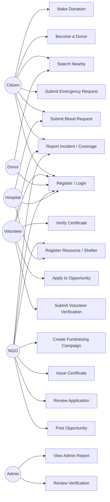

# Use Cases — VERA

**Document:** 15-use-cases.md
**Phase:** Software Requirements Specification (SRS)
**Project:** VERA — Volunteer Emergency Response Alliance
**Author:** [Your Name] — SRS & TDD module owner

## 1. Actors

- **Citizen** — any registered member of the public
- **Volunteer** — a citizen who has registered/upgraded to the Volunteer role
- **Donor** — a user who has registered blood-donation availability
- **NGO** — relief organization account
- **Hospital** — hospital / blood bank account
- **Admin** — platform administrator

## 2. Use Case Diagram

## 3. Actor × Use Case Summary

| Use Case | Citizen | Volunteer | Donor | NGO | Hospital | Admin |
|---|---|---|---|---|---|---|
| Register / Login | ✓ | ✓ | ✓ | ✓ | ✓ | ✓ |
| Submit Emergency Request | ✓ | ✓ | ✓ | ✓ | ✓ | ✓ |
| Submit Blood Request | ✓ | ✓ | ✓ | ✓ | ✓ | ✓ |
| Become a Donor | ✓ | — | — | — | — | — |
| Submit Volunteer Verification | — | ✓ | — | — | — | — |
| Review Verification | — | — | — | — | — | ✓ |
| Apply to Opportunity | — | ✓ | — | — | — | — |
| Post Opportunity | — | — | — | ✓ | — | ✓ |
| Issue / Verify Certificate | — | (verify) | — | ✓ (issue) | — | ✓ (issue) |
| Create Fundraising Campaign | — | — | — | ✓ | — | ✓ |
| Make Donation | ✓ | ✓ | ✓ | ✓ | ✓ | ✓ |
| Register Resource / Shelter | — | — | — | ✓ | ✓ | ✓ |
| Report Incident / Coverage | ✓ | ✓ | — | ✓ | — | ✓ |
| Search Nearby | ✓ | ✓ | ✓ | ✓ | ✓ | ✓ |
| View Admin Report | — | — | — | — | — | ✓ |

## 4. Detailed Use Cases

### UC-2: Submit Emergency Request

| Field | Description |
|---|---|
| **Actor** | Citizen (or any authenticated user) |
| **Precondition** | User is logged in (holds a valid JWT). |
| **Trigger** | User encounters or witnesses an emergency. |
| **Main Flow** | 1. User opens the Emergencies page. 2. User enters title, description, emergency type, and optionally location/coordinates/contact phone. 3. System validates the input (title ≥ 3 chars, description ≥ 10 chars). 4. System creates the emergency request with status "Open" and links it to the requester. 5. System returns the created record and the UI confirms submission. |
| **Alternate Flow** | If validation fails, the system returns a 422 error and the UI displays the specific field error. |
| **Postcondition** | A new emergency request exists with status Open, visible in emergency listings to all users. |

### UC-3: Submit Blood Request (with automatic donor notification)

| Field | Description |
|---|---|
| **Actor** | Citizen, Hospital, or any authenticated user |
| **Precondition** | User is logged in. |
| **Trigger** | A patient needs blood urgently. |
| **Main Flow** | 1. User submits patient name, blood group, units needed, hospital name, location, and contact phone. 2. System creates the blood request with status "Open." 3. System queries all users with role Donor, matching blood group, `available_for_donation = true`, and active accounts. 4. System creates an in-app notification for each matching donor. 5. Donors see the alert; matched donors may respond via their own contact details. |
| **Alternate Flow** | If no donors match, the request is still created but no notifications are generated; it remains visible in the open blood-requests list for general visibility. |
| **Postcondition** | Blood request is recorded; all matching available donors are notified. |

### UC-4: Become a Blood Donor

| Field | Description |
|---|---|
| **Actor** | Citizen |
| **Precondition** | User has an existing account (any role). |
| **Main Flow** | 1. User opens "Become a Donor." 2. User submits blood group, availability flag, and optionally updated phone/address. 3. System updates the user's role to Donor and stores the donor attributes. |
| **Postcondition** | User now appears in donor search results and receives blood-request alerts matching their group. |

### UC-5 / UC-6: Volunteer Verification (Submit + Review)

| Field | Description |
|---|---|
| **Actors** | Volunteer (submits), Admin (reviews) |
| **Precondition** | User has registered with role Volunteer. |
| **Main Flow** | 1. Volunteer submits ID document type (NID/Passport/Other) and document number. 2. System sets `verification_status = Pending` and `is_verified = false`. 3. Admin opens the pending verification list and reviews the submission. 4. Admin approves or rejects. 5. System updates `verification_status` and `is_verified` accordingly and notifies the volunteer. |
| **Alternate Flow** | If rejected, the volunteer remains unverified and may resubmit with corrected information. |
| **Postcondition** | Volunteer's verification status reflects the Admin's decision; verified volunteers may be assigned to emergencies and apply to opportunities requiring trust. |

### UC-7/UC-9: Apply to a Volunteer Opportunity (with review)

| Field | Description |
|---|---|
| **Actors** | Volunteer (applies), NGO/Admin (reviews) |
| **Precondition** | An opportunity exists with status Open and `filled_slots < slots`. |
| **Main Flow** | 1. Volunteer browses open opportunities. 2. Volunteer applies; system creates an Application with status Pending. 3. NGO/Admin reviews the application and approves or rejects it. 4. On approval, system increments `filled_slots`; if slots are now full, the opportunity's status is set to Closed automatically. |
| **Postcondition** | Application status reflects the decision; opportunity availability is kept accurate without manual recount. |

### UC-12/UC-13: Create a Fundraising Campaign and Donate

| Field | Description |
|---|---|
| **Actors** | NGO/Admin (creates campaign), any user (donates) |
| **Main Flow** | 1. NGO creates a campaign with title, description, cause, and goal amount. 2. Any user records a donation (money or in-kind), optionally selecting the campaign. 3. If the donation is monetary and tied to a campaign, the system adds the amount to the campaign's `raised_amount` and records the allocation. |
| **Postcondition** | Campaign progress is updated in real time as donations are recorded; donors can see their own donation history. |

### UC-15: Report Disaster Coverage / Underserved Area

| Field | Description |
|---|---|
| **Actors** | Volunteer, NGO, or Admin |
| **Main Flow** | 1. User reports an area's coverage status (Served, Partial, Underserved, Critical) with coordinates and notes. 2. System stores the report. 3. If status is Underserved or Critical, the system automatically notifies every NGO account so relief can be redirected. |
| **Postcondition** | All NGOs are alerted to under-resourced areas without needing to poll the system manually. |

### UC-16: Search Nearby

| Field | Description |
|---|---|
| **Actor** | Any authenticated user |
| **Main Flow** | 1. User provides their current latitude/longitude, a search radius (≤ 200 km), and optionally a type filter (volunteer, hospital, NGO, donor, shelter, resource, emergency). 2. System computes the Haversine distance from the search point to each matching record with coordinates. 3. System returns matching records within the radius, sorted by distance ascending. |
| **Postcondition** | User receives a ranked list of nearby help/resources relevant to their situation. |

## 5. Traceability Note

Each use case above maps to one or more functional requirements in `13-functional-requirements.md` and to specific endpoints documented in `22-api-design.md`.
