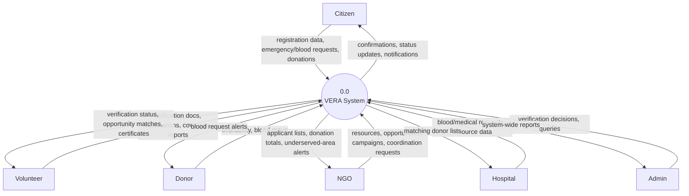
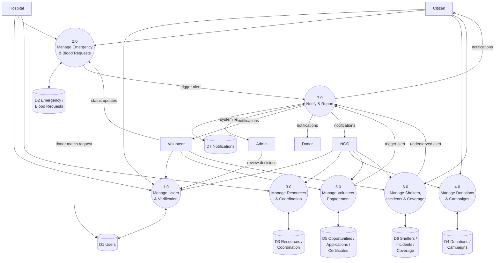

# Data Flow Diagrams (DFD) — VERA

**Document:** 16-dfd.md
**Phase:** Software Requirements Specification (SRS)
**Project:** VERA — Volunteer Emergency Response Alliance
**Author:** [Your Name] — SRS & TDD module owner

## 1. Purpose

This document models how data moves through VERA: which external entities send/receive data, which processes transform it, and which data stores persist it. Diagrams use standard DFD conventions: rectangles for external entities, rounded nodes for processes, and cylinder shapes for data stores.

## 2. Context Diagram (Level 0)

The context diagram treats VERA as a single process and shows all external entities that interact with it.

## 3. Level 1 DFD — Major Process Decomposition

Level 1 decomposes the single system process into seven major processes and the data stores they read from or write to.

## 4. Process Descriptions

| Process | Description | Implements |
|---|---|---|
| 1.0 Manage Users & Verification | Registration, login, profile retrieval, donor self-registration, volunteer ID verification submission and Admin review | `auth.py`, parts of `features.py` |
| 2.0 Manage Emergency & Blood Requests | Create/list/update emergency requests; create/list/update blood requests; donor matching | `emergencies.py`, `blood.py` |
| 3.0 Manage Resources & Coordination | NGO/Hospital resource registration; NGO coordination requests and status updates | `features.py` (resources, coordination) |
| 4.0 Manage Donations & Campaigns | Recording donations, linking to campaigns, updating raised amounts, campaign creation | `features.py` (donations, campaigns) |
| 5.0 Manage Volunteer Engagement | Opportunity posting, applications, approval, certificate issuance and verification | `features.py` (opportunities, applications, certificates) |
| 6.0 Manage Shelters, Incidents & Coverage | Shelter registration, incident reports, disaster coverage status reporting | `features.py` (shelters, incidents, coverage) |
| 7.0 Notify & Report | Generates notifications triggered by other processes; aggregates dashboard stats and Admin reports | `services/notifications.py`, `stats.py`, `reports.py` |

## 5. Data Store Reference

| Store | Physical Table(s) |
|---|---|
| D1 Users | `users` |
| D2 Emergency / Blood Requests | `emergency_requests`, `blood_requests` |
| D3 Resources / Coordination | `resources`, `ngo_coordinations` |
| D4 Donations / Campaigns | `donations`, `fundraising_campaigns` |
| D5 Opportunities / Applications / Certificates | `volunteer_opportunities`, `volunteer_applications`, `certificates` |
| D6 Shelters / Incidents / Coverage | `shelters`, `incident_reports`, `disaster_coverage` |
| D7 Notifications | `notifications` |

Full column-level detail for each table is documented in `21-database-design.md`.

## 6. Traceability Note

Each process above corresponds to one or more functional requirement modules in `13-functional-requirements.md`, and each data store corresponds to one or more entities in `18-erd.md`.
