# Entity-Relationship Diagram (ERD) — VERA

**Document:** 18-erd.md
**Phase:** Technical Design Document (TDD)
**Project:** VERA — Volunteer Emergency Response Alliance
**Author:** [Your Name] — SRS & TDD module owner

## 1. Purpose

This document presents the conceptual/logical data model for VERA: the 14 entities implemented as SQLAlchemy models, their attributes, and the relationships between them. The physical schema (column types, constraints, indexes) is detailed separately in `21-database-design.md`; this document focuses on structure and cardinality.

## 2. Entity-Relationship Diagram

```mermaid
erDiagram
    USERS {
        int id PK
        string email
        string full_name
        string phone
        enum role
        string organization_name
        float latitude
        float longitude
        enum blood_group
        bool available_for_donation
        enum verification_status
        bool is_verified
        datetime created_at
    }
    EMERGENCY_REQUESTS {
        int id PK
        int requester_id FK
        string title
        enum emergency_type
        enum status
        float latitude
        float longitude
        int assigned_volunteer_id FK
        bool is_verified
        datetime created_at
    }
    BLOOD_REQUESTS {
        int id PK
        int requester_id FK
        string patient_name
        enum blood_group
        int units_needed
        string hospital_name
        enum status
        bool is_urgent
        datetime created_at
    }
    RESOURCES {
        int id PK
        int organization_id FK
        string name
        enum resource_type
        int quantity
        float latitude
        float longitude
        datetime created_at
    }
    NGO_COORDINATIONS {
        int id PK
        int requester_id FK
        string title
        int volunteers_needed
        enum status
        datetime created_at
    }
    DONATIONS {
        int id PK
        int donor_id FK
        int campaign_id FK
        enum donation_type
        float amount
        string allocated_to
        datetime created_at
    }
    FUNDRAISING_CAMPAIGNS {
        int id PK
        int creator_id FK
        string title
        string cause
        float goal_amount
        float raised_amount
        enum status
        datetime created_at
    }
    NOTIFICATIONS {
        int id PK
        int user_id FK
        string title
        string message
        bool is_read
        datetime created_at
    }
    SHELTERS {
        int id PK
        string name
        int capacity
        int available_beds
        int managed_by FK
        bool is_active
        datetime created_at
    }
    INCIDENT_REPORTS {
        int id PK
        int reporter_id FK
        string disaster_type
        string severity
        enum status
        datetime created_at
    }
    VOLUNTEER_OPPORTUNITIES {
        int id PK
        int organization_id FK
        string title
        int slots
        int filled_slots
        enum status
        datetime created_at
    }
    VOLUNTEER_APPLICATIONS {
        int id PK
        int opportunity_id FK
        int volunteer_id FK
        enum status
        datetime created_at
    }
    CERTIFICATES {
        int id PK
        int volunteer_id FK
        int organization_id FK
        string program_name
        string certificate_code
        datetime issue_date
    }
    DISASTER_COVERAGE {
        int id PK
        string area_name
        float latitude
        float longitude
        enum coverage_status
        int reported_by FK
        datetime updated_at
    }

    USERS ||--o{ EMERGENCY_REQUESTS : "submits (requester_id)"
    USERS ||--o{ EMERGENCY_REQUESTS : "assigned to (assigned_volunteer_id)"
    USERS ||--o{ BLOOD_REQUESTS : "submits"
    USERS ||--o{ RESOURCES : "manages"
    USERS ||--o{ NGO_COORDINATIONS : "creates"
    USERS ||--o{ DONATIONS : "makes"
    USERS ||--o{ FUNDRAISING_CAMPAIGNS : "creates"
    FUNDRAISING_CAMPAIGNS ||--o{ DONATIONS : "receives"
    USERS ||--o{ NOTIFICATIONS : "receives"
    USERS ||--o{ SHELTERS : "manages (managed_by)"
    USERS ||--o{ INCIDENT_REPORTS : "reports"
    USERS ||--o{ VOLUNTEER_OPPORTUNITIES : "posts"
    VOLUNTEER_OPPORTUNITIES ||--o{ VOLUNTEER_APPLICATIONS : "receives"
    USERS ||--o{ VOLUNTEER_APPLICATIONS : "applies (volunteer_id)"
    USERS ||--o{ CERTIFICATES : "earns (volunteer_id)"
    USERS ||--o{ CERTIFICATES : "issues (organization_id)"
    USERS ||--o{ DISASTER_COVERAGE : "reports (reported_by)"
```

## 3. Relationship Narrative

| Relationship | Cardinality | Notes |
|---|---|---|
| User → Emergency Request | 1-to-many | A user can submit many emergency requests; each request has exactly one requester. |
| User → Emergency Request (assigned volunteer) | 1-to-many, optional | `assigned_volunteer_id` is nullable; an emergency may have no volunteer assigned yet. |
| User → Blood Request | 1-to-many | Same pattern as emergency requests. |
| User (NGO/Hospital) → Resource | 1-to-many | `organization_id` ties each resource to the org that registered it. |
| User (NGO/Hospital) → NGO Coordination | 1-to-many | The requesting organization owns the coordination record. |
| User → Donation | 1-to-many | Every donation has exactly one donor. |
| Fundraising Campaign → Donation | 1-to-many, optional | A donation may optionally target a campaign (`campaign_id` nullable); untargeted donations are still recorded individually. |
| User (NGO) → Fundraising Campaign | 1-to-many | The campaign's `creator_id` is its owning organization. |
| User → Notification | 1-to-many | Each notification belongs to exactly one recipient. |
| User (NGO/Admin) → Shelter | 1-to-many, optional | `managed_by` is nullable in case a shelter is registered without a named manager. |
| User → Incident Report | 1-to-many | Each report has exactly one reporter. |
| User (NGO) → Volunteer Opportunity | 1-to-many | Each opportunity belongs to one posting organization. |
| Volunteer Opportunity → Volunteer Application | 1-to-many | One opportunity can receive many applications. |
| User (Volunteer) → Volunteer Application | 1-to-many | One volunteer can submit applications to multiple opportunities. |
| User → Certificate (as recipient) | 1-to-many | `volunteer_id` — a volunteer can hold many certificates. |
| User → Certificate (as issuer) | 1-to-many | `organization_id` — an org can issue many certificates. |
| User → Disaster Coverage | 1-to-many | `reported_by` ties each coverage report to its reporting user. |

## 4. Design Notes

- **Enums as native types:** Role, status, and type fields (e.g., `UserRole`, `EmergencyStatus`, `BloodGroup`, `CoverageStatus`) are implemented as native SQL `ENUM` columns rather than free-text strings, preventing invalid values at the database layer.
- **Soft role transitions:** "Becoming a Donor" does not create a separate donor table; it updates the existing `User` row's `role` and donor-specific columns (`blood_group`, `available_for_donation`). This keeps one identity per person across all roles they take on.
- **Self-referencing-style optional links:** Several foreign keys (`assigned_volunteer_id`, `campaign_id`, `managed_by`) are nullable, reflecting that these associations are formed *after* the base record is created, not at creation time.
- **No hard delete cascade defined yet:** The current models do not define `ON DELETE CASCADE` behavior; this is called out as a hardening item in `21-database-design.md`.

## 5. Traceability Note

This ERD is the data-design counterpart to the functional requirements in `13-functional-requirements.md`. Full column-level definitions, constraints, and indexing decisions are in `21-database-design.md`.
