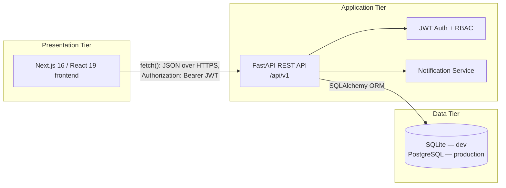
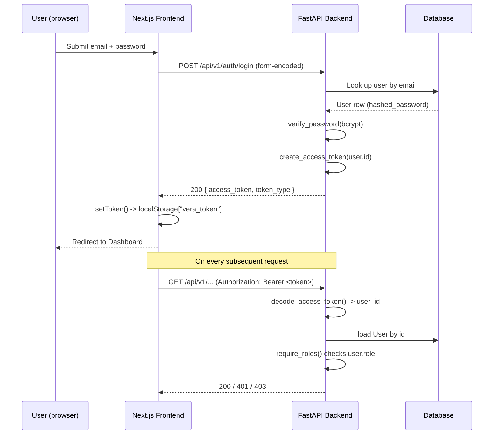
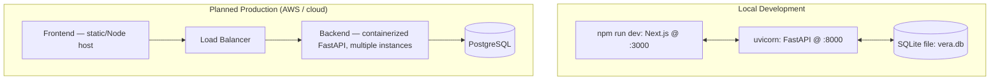

# System Design — VERA

**Document:** 19-system-design.md
**Phase:** Technical Design Document (TDD)
**Project:** VERA — Volunteer Emergency Response Alliance
**Author:** [Your Name] — SRS & TDD module owner

## 1. Architecture Overview

VERA follows a classic three-tier architecture: a browser-based presentation tier, a stateless API application tier, and a relational data tier.



The frontend never talks to the database directly; all data access goes through the versioned REST API, which enforces authentication and role checks before touching the database.

## 2. Backend Component Breakdown

| Layer | Module(s) | Responsibility |
|---|---|---|
| Entry point | `app/main.py` | App factory, CORS middleware, table creation on startup, `/health` endpoint |
| Routing | `app/api/routes/*.py` | One router per feature area: `auth`, `emergencies`, `blood`, `features` (resources, coordination, donations, campaigns, notifications, shelters, incidents, opportunities, applications, certificates, coverage, donor registration, verification), `search`, `reports`, `stats` |
| Dependencies | `app/api/deps.py` | `get_current_user` (decodes JWT, loads the user), `require_roles(*roles)` (role-gate factory; Admin always passes) |
| Core | `app/core/config.py`, `database.py`, `security.py` | Environment-driven settings, SQLAlchemy engine/session, password hashing, JWT encode/decode |
| Domain models | `app/models/__init__.py` | 14 SQLAlchemy ORM entities and their enums (detailed in `18-erd.md`) |
| Schemas | `app/schemas/__init__.py` | Pydantic request/response models — the contract enforced at the API boundary |
| Services | `app/services/notifications.py` | Shared helper to create a `Notification` row, called from multiple routers |

## 3. Frontend Component Breakdown

| Module | Responsibility |
|---|---|
| `src/app/*/page.tsx` | One route per feature: home, login, register, dashboard, emergencies, blood, resources, donations, shelters, incidents, volunteers, coverage, search, notifications, admin |
| `src/lib/api.ts` | Thin typed `fetch` wrapper (`request<T>`) that attaches the `Authorization: Bearer <token>` header, sets JSON content-type, and normalizes API error responses into a typed `ApiError` |
| `src/lib/auth.ts` | Stores/retrieves/clears the JWT in `localStorage` under the key `vera_token`; exposes `isAuthenticated()` |
| `src/types` | Shared TypeScript types mirroring the backend's Pydantic schemas |

## 4. Authentication & Authorization Flow



Role enforcement (`require_roles`) is applied per-endpoint at the dependency-injection level, so unauthorized requests are rejected before any business logic or database write executes.

## 5. Key Workflow — Blood Request With Automatic Donor Matching

```mermaid
sequenceDiagram
    participant U as Requester
    participant API as Blood Router
    participant DB as Database
    participant N as Notification Service
    participant D as Matching Donors

    U->>API: POST /api/v1/blood/requests
    API->>DB: INSERT blood_requests (status = Open)
    API->>DB: SELECT users WHERE role=Donor
AND blood_group = requested
AND available_for_donation = true
    DB-->>API: Matching donor list
    loop For each matching donor
        API->>N: create_notification(donor.id, "Urgent blood request")
        N->>DB: INSERT notifications
    end
    API->>DB: COMMIT
    API-->>U: 201 Created (blood request)
    D->>API: GET /api/v1/notifications (poll on next page load)
    API-->>D: Unread notification list
```

This flow demonstrates the system's core value proposition: targeted, automatic routing of an urgent need to the people who can actually help, instead of a broadcast post on social media.

## 6. Deployment View (Current + Planned)



`npm run setup` provisions environment files and installs dependencies for both apps; `npm run dev` runs them concurrently for local development, matching what is documented in the project README.

## 7. Cross-Cutting Concerns

- **CORS:** the backend's allowed origins are read from `CORS_ORIGINS`, keeping the frontend domain explicit rather than wildcarded.
- **Error handling:** validation errors raise FastAPI's standard 422 responses with field-level detail; domain errors (not found, forbidden) raise explicit `HTTPException`s with 404/403 status codes, which the frontend's `request()` wrapper converts into a typed `ApiError` with a human-readable message.
- **Configuration:** all environment-specific values (`DATABASE_URL`, `SECRET_KEY`, `CORS_ORIGINS`, `NEXT_PUBLIC_API_URL`) are externalized, so the same codebase runs in dev, staging, or production by changing environment variables only.

## 8. Traceability Note

This system design realizes the functional and non-functional requirements in `13-functional-requirements.md` and `14-non-functional-requirements.md`. Its data layer is detailed in `18-erd.md` and `21-database-design.md`; its API contract is detailed in `22-api-design.md`.
