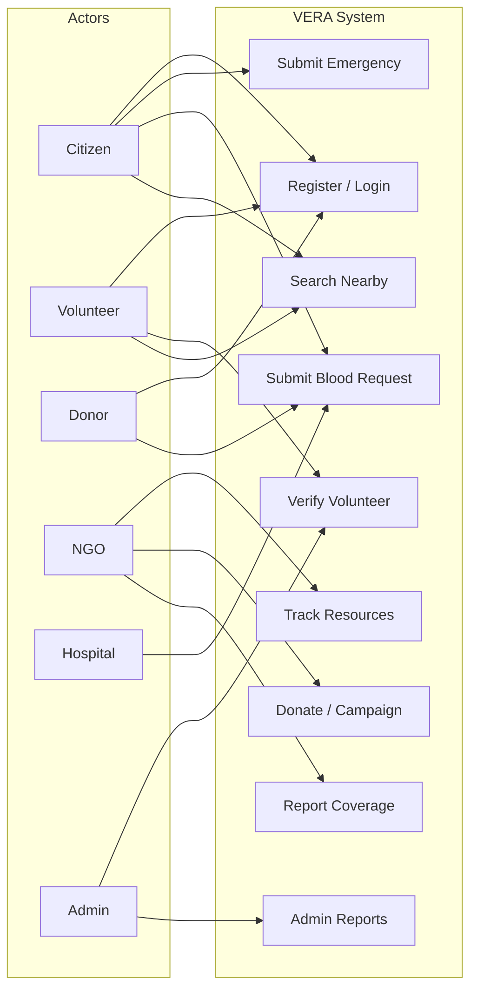

# 15 — Use Cases

**VERA: Volunteer Emergency Response Alliance**

## Document Information

| Field | Detail |
|-------|--------|
| **Phase** | 3 — Software Requirements Specification (SRS) |
| **Notation** | UML Use Case style |

---

## Actors

| Actor | Description |
|-------|-------------|
| **Citizen** | Person seeking emergency or blood assistance |
| **Volunteer** | Verified/unverified helper responding to requests |
| **Donor** | Blood or financial/material contributor |
| **NGO** | Humanitarian organization coordinator |
| **Hospital** | Medical facility / blood bank liaison |
| **Administrator** | Platform manager |
| **System** | Automated VERA backend (notifications, matching) |

---

## Use Case Diagram (Overview)

---

## UC-01 — Register Account

| Field | Detail |
|-------|--------|
| **ID** | UC-01 |
| **Name** | Register Account |
| **Actor** | Guest (unauthenticated user) |
| **Precondition** | User has valid email not already registered |
| **Postcondition** | Account created with selected role |

**Main Flow:**
1. User opens registration page
2. User enters email, password, name, phone, role
3. System validates input
4. System creates user record
5. User is redirected to login or auto-logged in

**Alternate Flows:**
- 3a. Email exists → System displays error
- 3b. Password < 8 chars → Validation error

**Related FR:** FR-01

---

## UC-02 — Login

| Field | Detail |
|-------|--------|
| **ID** | UC-02 |
| **Actor** | Registered user |
| **Postcondition** | JWT issued, user accesses dashboard |

**Main Flow:**
1. User enters email and password
2. System validates credentials
3. System returns JWT token
4. Frontend stores token and loads dashboard

**Alternate:** Invalid credentials → Error message

**Related FR:** FR-02

---

## UC-03 — Submit Emergency Request

| Field | Detail |
|-------|--------|
| **ID** | UC-03 |
| **Actor** | Citizen (any authenticated user) |
| **Precondition** | User is logged in |
| **Postcondition** | Emergency request created with status `open` |

**Main Flow:**
1. User navigates to Emergencies page
2. User fills title, description, type, location, phone
3. System validates (description ≥ 10 chars)
4. System saves emergency request
5. Request appears in list

**Related FR:** FR-08

---

## UC-04 — Verify Emergency Request

| Field | Detail |
|-------|--------|
| **ID** | UC-04 |
| **Actor** | Volunteer, NGO, Hospital, Admin |
| **Precondition** | Emergency exists, actor has verify permission |
| **Postcondition** | `is_verified = true`, status may be `verified` |

**Main Flow:**
1. Responder views open emergencies
2. Responder clicks Verify
3. System updates request
4. Request marked verified in list

**Related FR:** FR-09

---

## UC-05 — Create Blood Request

| Field | Detail |
|-------|--------|
| **ID** | UC-05 |
| **Actor** | Citizen, Hospital |
| **Postcondition** | Blood request created; matching donors notified |

**Main Flow:**
1. User opens Blood page
2. User enters patient name, blood group, units, hospital, phone
3. System saves request
4. **System** notifies all matching available donors
5. Request shown in list

**Related FR:** FR-10, FR-12

---

## UC-06 — Search Blood Donors

| Field | Detail |
|-------|--------|
| **ID** | UC-06 |
| **Actor** | Hospital, NGO, Citizen |
| **Postcondition** | List of donors for selected blood group |

**Main Flow:**
1. User selects blood group
2. User clicks Search
3. System returns donors with name, phone, address

**Related FR:** FR-12

---

## UC-07 — Submit Volunteer Verification

| Field | Detail |
|-------|--------|
| **ID** | UC-07 |
| **Actor** | Volunteer |
| **Postcondition** | Verification status = `pending` |

**Main Flow:**
1. Volunteer opens Volunteers page
2. Volunteer selects document type (NID/Passport/Other)
3. Volunteer enters document number
4. System saves and sets pending status

**Related FR:** FR-05

---

## UC-08 — Approve Volunteer Verification

| Field | Detail |
|-------|--------|
| **ID** | UC-08 |
| **Actor** | Administrator |
| **Postcondition** | `is_verified = true`, notification sent |

**Main Flow:**
1. Admin reviews volunteer submission
2. Admin approves verification
3. System updates user record
4. System sends notification to volunteer

**Related FR:** FR-06

---

## UC-09 — Manage NGO Resources

| Field | Detail |
|-------|--------|
| **ID** | UC-09 |
| **Actor** | NGO, Hospital |
| **Postcondition** | Resource record created |

**Main Flow:**
1. NGO opens Resources page
2. NGO enters name, type, quantity, location
3. System saves resource
4. Resource visible in list

**Related FR:** FR-13

---

## UC-10 — Create Fundraising Campaign

| Field | Detail |
|-------|--------|
| **ID** | UC-10 |
| **Actor** | NGO |
| **Postcondition** | Campaign active with goal amount |

**Main Flow:**
1. NGO opens Donations page
2. NGO enters title, cause, description, goal
3. System creates campaign
4. Campaign visible with ৳0 raised

**Related FR:** FR-16

---

## UC-11 — Donate to Campaign

| Field | Detail |
|-------|--------|
| **ID** | UC-11 |
| **Actor** | Donor (any user) |
| **Postcondition** | Donation logged; campaign raised_amount updated |

**Main Flow:**
1. User selects campaign
2. User enters amount and donation type
3. System records donation
4. System increments campaign raised amount
5. Allocation shown in donation history

**Related FR:** FR-15, FR-16

---

## UC-12 — Report Disaster Coverage

| Field | Detail |
|-------|--------|
| **ID** | UC-12 |
| **Actor** | NGO, Volunteer, Admin |
| **Postcondition** | Coverage area recorded; NGOs alerted if critical |

**Main Flow:**
1. User opens Coverage page
2. User enters area name, coordinates, status
3. System saves coverage record
4. If status is underserved/critical, System notifies NGOs

**Related FR:** FR-19

---

## UC-13 — Search Nearby Help

| Field | Detail |
|-------|--------|
| **ID** | UC-13 |
| **Actor** | Any authenticated user |
| **Postcondition** | Distance-sorted results returned |

**Main Flow:**
1. User enters latitude/longitude (or uses GPS)
2. User optionally filters by type
3. System calculates haversine distance
4. System returns results within radius (default 25 km)

**Related FR:** FR-22

---

## UC-14 — Issue Volunteer Certificate

| Field | Detail |
|-------|--------|
| **ID** | UC-14 |
| **Actor** | NGO |
| **Postcondition** | Certificate with unique code issued |

**Main Flow:**
1. NGO enters volunteer ID and program name
2. System generates certificate code (VERA-XXXXXXXXXX)
3. System notifies volunteer
4. Certificate appears in volunteer's list

**Related FR:** FR-21

---

## UC-15 — View Admin Report

| Field | Detail |
|-------|--------|
| **ID** | UC-15 |
| **Actor** | Administrator |
| **Postcondition** | Operational statistics displayed |

**Main Flow:**
1. Admin opens Admin page
2. System returns users by role, emergencies by status, donations, etc.
3. Admin reviews metrics

**Related FR:** FR-25

---

## Use Case Summary Table

| ID | Name | Primary Actor | Priority |
|----|------|---------------|----------|
| UC-01 | Register Account | Guest | P0 |
| UC-02 | Login | User | P0 |
| UC-03 | Submit Emergency | Citizen | P0 |
| UC-04 | Verify Emergency | Volunteer/NGO | P0 |
| UC-05 | Create Blood Request | Citizen/Hospital | P0 |
| UC-06 | Search Blood Donors | Hospital | P0 |
| UC-07 | Submit Verification | Volunteer | P0 |
| UC-08 | Approve Verification | Admin | P0 |
| UC-09 | Manage Resources | NGO | P1 |
| UC-10 | Create Campaign | NGO | P1 |
| UC-11 | Donate to Campaign | Donor | P1 |
| UC-12 | Report Coverage | NGO | P1 |
| UC-13 | Search Nearby | User | P1 |
| UC-14 | Issue Certificate | NGO | P2 |
| UC-15 | View Admin Report | Admin | P1 |

---

## Phase Navigation

| | Document |
|---|----------|
| **Previous** | [14 — Non-Functional Requirements](./14-non-functional-requirements.md) |
| **Current** | 15 — Use Cases |
| **Next** | [16 — DFD](./16-dfd.md) |

---

*Phase 3 — Software Requirements Specification | VERA*
