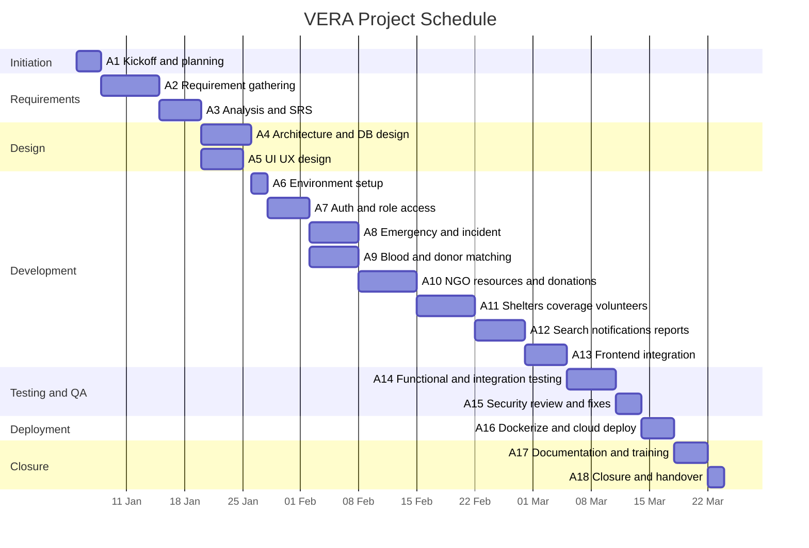
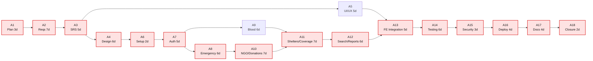

# CSE307 — System Analysis and Development Issues (Task 5: A, B, C, D)

**Title:** Volunteer Emergency Response Alliance (VERA)

A platform that connects people in need with volunteers, donors, NGOs, hospitals, emergency responders, and relief organizations through a centralized emergency assistance network.

**Course:** CSE307 — System Analysis and Design · **Currency:** BDT (৳)

---

## Group Members

| ID | Name | Contribution |
|----|------|--------------|
| 2311960 | Md. Mahmudul Hasan | 100% |
| 2310604 | Ridwan Hasan Khandakar | 100% |
| 2022752 | Kazi Fatema Tuj Johra | 100% |
| 2312226 | Fouzia Abida | 100% |
| 2310690 | Syed Mehedi Hussain | 100% |
| 2210892 | Sowhardra Paul | 100% |

## Contribution Distribution (Who Did What)

| ID | Name | Assigned Part(s) | Work Done |
|----|------|------------------|-----------|
| 2311960 | Md. Mahmudul Hasan | **Section A** | Software Development Methodology (Agile/Scrum selection and justification) + document integration |
| 2310604 | Ridwan Hasan Khandakar | **B1 + B2** | Work Breakdown Structure (WBS) and Activity List (duration, dependencies, resources, cost) |
| 2022752 | Kazi Fatema Tuj Johra | **B3 + B4** | Gantt Chart and Network Diagram (PERT) with critical path |
| 2312226 | Fouzia Abida | **C1 + C2** | Feasibility: Expense heads and Benefits (tangible + intangible) |
| 2310690 | Syed Mehedi Hussain | **C3 + C4** | Feasibility: NPV table and ROI / break-even |
| 2210892 | Sowhardra Paul | **D1 – D4** | Requirement Discovery: methods, plan, functional and non-functional requirements |

> Each part below is marked with **Assigned to** so the contribution of each member is clear.

## Table of Contents

- [Section A — Software Development Methodology](#section-a--software-development-methodology)
- [Section B — Project Management](#section-b--project-management)
- [Section C — Feasibility Analysis](#section-c--feasibility-analysis)
- [Section D — Requirement Discovery](#section-d--requirement-discovery)

---
---

# Section A — Software Development Methodology

> **Assigned to:** Md. Mahmudul Hasan (2311960)

## A1. Selecting a Software Development Methodology (with Justification)

### A1.1 Our Choice

For the VERA project, we selected the **Agile methodology using the Scrum framework** (Lecture 6).

In simple words, Agile means we build the software in small pieces, show a working piece to users early, take their feedback, and keep improving. We do not try to plan everything perfectly at the start and build it all at once.

### A1.2 Why Agile Is Suitable for VERA (Justification)

We picked Agile because it matches the nature of our project. The reasons are:

1. **Our requirements kept changing.** When we started, we did not know all the features. After doing interviews and surveys, we discovered new needs (for example, disaster coverage monitoring). One of the basic principles of Agile is to *"embrace change, even if introduced late in development"* (Lecture 6). A fixed method like Waterfall could not handle this.

2. **VERA has many modules.** We have separate parts like login, emergencies, blood requests, donations, shelters, and reports. Agile lets us *"deliver functioning software incrementally and frequently"* — we build one module at a time and show it working.

3. **We wanted feedback early.** Agile *"encourages customers and analysts to work together daily."* An NGO can look at each part and tell us if it is correct before we build the next part.

4. **Our team is small and self-organizing.** Scrum works well for small teams that plan their own work, which fits our six-member group.

5. **It lowers risk.** By building and testing small pieces, we find problems early instead of at the end. This is very important for an emergency platform where mistakes can be serious.

### A1.3 Agile Values We Followed (Lecture 6)

Agile is built on four values, and we tried to keep all of them:

| Value | How we applied it in VERA |
|-------|----------------------------|
| **Communication** | The team talked daily and kept in touch with the NGO representative. |
| **Simplicity** | We built the simplest thing that works first, then improved it. |
| **Feedback** | We showed each finished module to users and took their comments. |
| **Courage** | We were willing to change or remove features when feedback told us to. |

### A1.4 The Four Core Practices of Agile (Lecture 6)

Lecture 6 lists four core practices. We adopted all four:

| Core Practice | How VERA used it |
|---------------|------------------|
| **Short releases** | Every 2 weeks we released a small working version, so the system could grow step by step. |
| **40-hour work week** | We worked at a steady, healthy pace instead of rushing at the end. This keeps quality high and reduces mistakes. |
| **Onsite customer** | An **NGO representative** acted as our onsite customer, giving quick answers and feedback about real emergency needs. |
| **Pair programming** | For the hard and risky modules (login/security and blood donor matching), two members coded together to catch mistakes early and improve quality. |

### A1.5 The Scrum Framework We Used (Lecture 6)

Scrum is the Agile approach we followed. Its main parts are:

**Roles:**

| Role | Who / What it means |
|------|---------------------|
| **Product Owner** | Decides what features are most important (kept the feature list ordered by priority). |
| **Scrum Master** | Helps the team, removes problems, and runs the meetings. |
| **Development Team** | The members who design, code, and test the software. |

**Scrum artifacts and events (in simple terms):**

| Term | Meaning in VERA |
|------|-----------------|
| **Product Backlog** | The full list of all features we want (our requirements FR-01 to FR-25). |
| **Sprint Backlog** | The small set of features we chose to build in one sprint. |
| **Sprint** | A short 2-week period in which we build the chosen features. |
| **Daily Scrum** | A short daily meeting to say what we did, what we will do, and any problem. |
| **Demo** | At the end of a sprint we show the working software to users. |

### A1.6 How We Divided the Work into Sprints

| Sprint | What we built |
|--------|---------------|
| Sprint 1 | Registration, login, roles (FR-01 to FR-04) |
| Sprint 2 | Emergency and incident reporting (FR-08, FR-09, FR-18) |
| Sprint 3 | Blood requests and donor matching (FR-07, FR-10 to FR-12) |
| Sprint 4 | NGO resources, coordination, donations (FR-13 to FR-16) |
| Sprint 5 | Shelters, coverage, volunteers, certificates (FR-05, FR-06, FR-17, FR-19 to FR-21) |
| Sprint 6 | Search, notifications, dashboard, admin reports (FR-22 to FR-25) |
| Sprint 7 | Testing, security fixes, deployment |

### A1.7 We Also Used Prototyping (Lecture 6)

Along with Scrum, we used **prototyping** to gather requirements. We mostly used the **selected-features prototype** — an early version with some (not all) features — so users could see the screens and tell us what to change before we finished the real system.

### A1.8 Why We Did Not Choose Other Methods

| Method | Why we did not choose it |
|--------|--------------------------|
| **Waterfall** | It needs all requirements fixed at the beginning. Our requirements kept changing, so this did not fit. Also, no working software is seen until the very end. |
| **V-Model** | Good for testing, but still fixed and step-by-step like Waterfall. |
| **Spiral** | Good for risk, but too heavy and needs too much documentation for a student team. |

**Section A summary:** We selected the **Agile methodology (Scrum framework)** for VERA because our requirements changed over time, our system has many modules, and we needed early feedback. We followed the four Agile values, the four core practices, the Scrum process, and used prototyping to confirm requirements.

---
---

# Section B — Project Management

## B1. Project Plan and Work Breakdown Structure (WBS)

> **Assigned to:** Ridwan Hasan Khandakar (2310604)

### B1.1 What Is a WBS?

As we learned in Lecture 3, a big project is hard to manage as one large job. So we break it down into smaller tasks or activities. Together these tasks form a **Work Breakdown Structure (WBS)**.

Lecture 3 also gives three **WBS properties**, which we followed:
1. Each task gives **one deliverable** (one clear result).
2. Each task can be given to a **single person or group**.
3. Each task has **one responsible person** who monitors it.

### B1.2 Basis of Our WBS

The task says the WBS can be based on the **software modules** or the **entire project**. We based ours on the **entire project**. This means all seven phases of the project (planning, requirements, design, development, testing, deployment, and documentation) are broken down. Inside the **Development** phase, we also break the work down by **software module**, so both ideas are covered.

### B1.3 WBS — Indented List

```
1.0  VERA — Emergency Response Platform
├── 1.1  Project Initiation & Planning
│    ├── 1.1.1  Define scope, goals, objectives
│    ├── 1.1.2  Form team & assign roles
│    └── 1.1.3  Prepare project & sprint plan
├── 1.2  Requirements & Analysis
│    ├── 1.2.1  Requirement gathering (interviews, surveys, observation)
│    ├── 1.2.2  Requirement analysis & SRS
│    └── 1.2.3  Feasibility confirmation
├── 1.3  System Design
│    ├── 1.3.1  System architecture & database design
│    └── 1.3.2  UI/UX design (screens, wireframes)
├── 1.4  Development (by module)
│    ├── 1.4.1  Environment & project setup
│    ├── 1.4.2  Authentication & role access module
│    ├── 1.4.3  Emergency & incident module
│    ├── 1.4.4  Blood request & donor-matching module
│    ├── 1.4.5  NGO resources, coordination & donations module
│    ├── 1.4.6  Shelters, coverage, volunteers & certificates module
│    ├── 1.4.7  Search, notifications, dashboard & admin reports
│    └── 1.4.8  Frontend integration
├── 1.5  Testing & Quality Assurance
│    ├── 1.5.1  Functional & integration testing
│    └── 1.5.2  Security review & fixes
├── 1.6  Deployment
│    └── 1.6.1  Dockerization & cloud deployment
└── 1.7  Documentation & Closure
     ├── 1.7.1  Documentation & training material
     └── 1.7.2  Project closure & handover
```

### B1.4 WBS — Diagram

All seven phases are broken down to the third level. The Development phase is broken down by software module.

```mermaid
graph TD
    P[1.0 VERA Platform]

    P --> W1[1.1 Initiation & Planning]
    W1 --> W1a[1.1.1 Scope & objectives]
    W1 --> W1b[1.1.2 Team & roles]
    W1 --> W1c[1.1.3 Project & sprint plan]

    P --> W2[1.2 Requirements & Analysis]
    W2 --> W2a[1.2.1 Requirement gathering]
    W2 --> W2b[1.2.2 Analysis & SRS]
    W2 --> W2c[1.2.3 Feasibility confirmation]

    P --> W3[1.3 System Design]
    W3 --> W3a[1.3.1 Architecture & DB design]
    W3 --> W3b[1.3.2 UI/UX design]

    P --> W4[1.4 Development - by module]
    W4 --> M0[1.4.1 Environment setup]
    W4 --> M1[1.4.2 Auth & role access]
    W4 --> M2[1.4.3 Emergency & Incident]
    W4 --> M3[1.4.4 Blood & Donor Matching]
    W4 --> M4[1.4.5 NGO, Resources & Donations]
    W4 --> M5[1.4.6 Shelters, Coverage, Volunteers]
    W4 --> M6[1.4.7 Search, Notifications, Reports]
    W4 --> M7[1.4.8 Frontend Integration]

    P --> W5[1.5 Testing & QA]
    W5 --> W5a[1.5.1 Functional & integration testing]
    W5 --> W5b[1.5.2 Security review & fixes]

    P --> W6[1.6 Deployment]
    W6 --> W6a[1.6.1 Dockerize & cloud deploy]

    P --> W7[1.7 Documentation & Closure]
    W7 --> W7a[1.7.1 Documentation & training]
    W7 --> W7b[1.7.2 Closure & handover]
```



## B2. Activity List (Duration, Dependencies, Resources, and Cost)

> **Assigned to:** Ridwan Hasan Khandakar (2310604)

### B2.1 Team Codes (Responsible Person)

Following the WBS rule that **each task has one responsible person**, we gave every activity a single owner from our group.

| Code | Group member |
|------|--------------|
| MH | Md. Mahmudul Hasan |
| RHK | Ridwan Hasan Khandakar |
| KFJ | Kazi Fatema Tuj Johra |
| FA | Fouzia Abida |
| SMH | Syed Mehedi Hussain |
| SP | Sowhardra Paul |

### B2.2 Resource Rates

To estimate cost, we gave each role a daily rate (as Lecture 3 says: estimate the cost for each activity in the WBS).

| Role | Rate/day (৳) |
|------|-------------|
| Project Manager (PM) | 3,000 |
| Business Analyst (BA) | 2,500 |
| System Architect (SA) | 3,000 |
| UI/UX Designer (UX) | 2,200 |
| Backend Developer (BE) | 2,500 |
| Frontend Developer (FE) | 2,500 |
| Full-stack Developer (FS) | 2,800 |
| QA Engineer (QA) | 2,000 |
| DevOps Engineer (DO) | 2,800 |
| Technical Writer (TW) | 1,800 |

### B2.3 Activity List Table

Cost of each activity = duration × the role's daily rate.

| ID | Activity | Duration (days) | Depends on | Role | Responsible | Cost (৳) |
|----|----------|-----------------|------------|------|-------------|----------|
| A1 | Project kickoff & planning | 3 | — | PM | MH | 9,000 |
| A2 | Requirement gathering | 7 | A1 | BA | KFJ | 17,500 |
| A3 | Requirement analysis & SRS | 5 | A2 | BA | KFJ | 12,500 |
| A4 | System architecture & database design | 6 | A3 | SA | MH | 18,000 |
| A5 | UI/UX design | 5 | A3 | UX | FA | 11,000 |
| A6 | Environment & project setup | 2 | A4 | BE | RHK | 5,000 |
| A7 | Authentication & role access module | 5 | A6 | BE | MH | 12,500 |
| A8 | Emergency & incident module | 6 | A7 | FS | RHK | 16,800 |
| A9 | Blood request & donor-matching module | 6 | A7 | BE | SMH | 15,000 |
| A10 | NGO resources, coordination & donations | 7 | A8 | FS | SP | 19,600 |
| A11 | Shelters, coverage, volunteers & certificates | 7 | A9, A10 | FS | FA | 19,600 |
| A12 | Search, notifications, dashboard & admin reports | 6 | A11 | FS | SMH | 16,800 |
| A13 | Frontend integration | 5 | A5, A12 | FE | RHK | 12,500 |
| A14 | Functional & integration testing | 6 | A13 | QA | KFJ | 12,000 |
| A15 | Security review & fixes | 3 | A14 | BE | MH | 7,500 |
| A16 | Dockerization & cloud deployment | 4 | A15 | DO | SP | 11,200 |
| A17 | Documentation & training | 4 | A16 | TW | FA | 7,200 |
| A18 | Project closure & handover | 2 | A17 | PM | MH | 6,000 |
| | **Total** | | | | | **229,700** |

**Total labour cost = ৳ 229,700.** (Other costs like servers and tools are added in Section C.)

## B3. Gantt Chart

> **Assigned to:** Kazi Fatema Tuj Johra (2022752)

Lecture 3 says a **Gantt chart** is a simple, easy-to-read chart drawn to scale that shows the schedule to users. Our schedule runs over about **12 weeks** (78 working days). In the chart below, a filled block (█) means the activity is being worked on during that week. Some activities overlap because they run in parallel (for example A4 and A5, or A8 and A9).

### Gantt Chart (Week View)

| Activity | W1 | W2 | W3 | W4 | W5 | W6 | W7 | W8 | W9 | W10 | W11 | W12 |
|----------|----|----|----|----|----|----|----|----|----|-----|-----|-----|
| A1 Kickoff & planning | █ | | | | | | | | | | | |
| A2 Requirement gathering | █ | █ | | | | | | | | | | |
| A3 Analysis & SRS | | █ | █ | | | | | | | | | |
| A4 Architecture & DB design | | | █ | █ | | | | | | | | |
| A5 UI/UX design | | | █ | | | | | | | | | |
| A6 Environment setup | | | | █ | | | | | | | | |
| A7 Auth & role access | | | | █ | █ | | | | | | | |
| A8 Emergency & incident | | | | | █ | | | | | | | |
| A9 Blood & donor matching | | | | | █ | | | | | | | |
| A10 NGO, resources & donations | | | | | █ | █ | | | | | | |
| A11 Shelters, coverage, volunteers | | | | | | █ | █ | | | | | |
| A12 Search, notifications, reports | | | | | | | █ | █ | | | | |
| A13 Frontend integration | | | | | | | | █ | █ | | | |
| A14 Functional & integration testing | | | | | | | | | █ | █ | | |
| A15 Security review & fixes | | | | | | | | | | █ | | |
| A16 Dockerize & cloud deploy | | | | | | | | | | █ | █ | |
| A17 Documentation & training | | | | | | | | | | | █ | |
| A18 Closure & handover | | | | | | | | | | | █ | █ |

*(This table renders in every viewer. Below is the same chart as a Mermaid diagram, which renders where Mermaid gantt is supported — e.g. GitHub.)*

### Same Chart (Mermaid — optional)



## B4. Network Diagram (PERT) and Critical Path

> **Assigned to:** Kazi Fatema Tuj Johra (2022752)

Lecture 3 says a **PERT / network diagram** is useful when some activities can be done in parallel, and it helps us find the **critical path** and the **slack time**. The diagram below shows each activity as a box (Activity-on-Node). The **critical path** is shown in red.



### B4.1 Critical Path

The **critical path** is the longest chain of activities. If any activity on it is late, the whole project is late.

```
A1 → A2 → A3 → A4 → A6 → A7 → A8 → A10 → A11 → A12 → A13 → A14 → A15 → A16 → A17 → A18
```

| Item | Value |
|------|-------|
| Critical path length | 3+7+5+6+2+5+6+7+7+6+5+6+3+4+4+2 = **78 days** |
| Total project time | **78 working days** |
| Activities with slack (not critical) | A5 (UI/UX) and A9 (Blood module) |

### B4.2 Forward Pass (Earliest Start and Finish)

This table shows when each activity can start and finish at the earliest.

| Activity | Duration | Earliest Start | Earliest Finish |
|----------|----------|----------------|-----------------|
| A1 | 3 | 0 | 3 |
| A2 | 7 | 3 | 10 |
| A3 | 5 | 10 | 15 |
| A4 | 6 | 15 | 21 |
| A5 | 5 | 15 | 20 |
| A6 | 2 | 21 | 23 |
| A7 | 5 | 23 | 28 |
| A8 | 6 | 28 | 34 |
| A9 | 6 | 28 | 34 |
| A10 | 7 | 34 | 41 |
| A11 | 7 | 41 | 48 |
| A12 | 6 | 48 | 54 |
| A13 | 5 | 54 | 59 |
| A14 | 6 | 59 | 65 |
| A15 | 3 | 65 | 68 |
| A16 | 4 | 68 | 72 |
| A17 | 4 | 72 | 76 |
| A18 | 2 | 76 | 78 |

**Slack (free time) example:** A5 finishes at day 20, but A13 does not start until day 54, so A5 has a lot of slack (it is not on the critical path). A9 finishes at day 34, but A11 starts at day 41, so A9 has 7 days of slack. The red activities have **no slack** — they must be done on time.

**Section B summary:** We broke VERA into a **WBS** (7 phases, Development split by module), made an **activity list** of 18 activities (total cost **৳ 229,700**), drew a **Gantt chart**, and used a **PERT/network diagram** to find the **critical path (78 days)** and the slack of A5 and A9.

---
---

# Section C — Feasibility Analysis

## What Is Feasibility? (Lecture 3)

Before building a system, we must check if it is worth doing. Lecture 3 says feasibility has **three key parts**:

1. **Technical feasibility** — can we build it with the technology we have?
2. **Economic feasibility** — are the benefits worth more than the cost?
3. **Operational feasibility** — will people actually use and operate it?

In this section we focus mostly on **economic feasibility**, using costs and benefits. Lecture 3 also teaches that benefits and costs can be **tangible** (measurable in money) or **intangible** (hard to measure in money).

## C1. List of Expense Heads (Cost to Build the Project)

> **Assigned to:** Fouzia Abida (2312226)

We divided our costs into **one-time costs** (paid once at the start, Year 0) and **yearly running costs** (paid every year).

### C1.1 One-Time Costs (Year 0)

| # | Expense Head | Cost (৳) |
|---|--------------|----------|
| 1 | Development labour (all activities A1–A18 from Section B) | 229,700 |
| 2 | Hardware (developer machines / test devices) | 40,000 |
| 3 | Cloud setup (server, storage, network) | 15,000 |
| 4 | Software tools & licences | 12,000 |
| 5 | Testing devices | 8,000 |
| 6 | Training material | 7,000 |
| 7 | Domain + SSL (first year) | 3,000 |
| | **Subtotal** | **314,700** |
| 8 | Contingency / risk buffer (10%) | 31,470 |
| | **Total one-time cost (Year 0)** | **346,170** |

### C1.2 Yearly Running Costs (Years 1–5)

| # | Expense Head | Cost/year (৳) |
|---|--------------|---------------|
| 1 | Cloud hosting | 36,000 |
| 2 | Maintenance & support | 60,000 |
| 3 | SMS / email service | 12,000 |
| 4 | Marketing & outreach | 20,000 |
| 5 | Domain + SSL renewal | 3,000 |
| | **Total yearly cost** | **≈ 130,000** |

## C2. Possible Benefits from the Project

> **Assigned to:** Fouzia Abida (2312226)

### C2.1 Tangible Benefits (Can Be Measured in Money)

| # | Benefit |
|---|---------|
| 1 | NGOs save money because coordination is faster (less phone calls, less duplicate work) |
| 2 | Less wasted relief supplies (coverage map stops two NGOs going to the same place) |
| 3 | More donations collected because donors trust the transparent system |
| 4 | Volunteers are matched faster, saving time |
| 5 | Money from sponsors, grants, and partnerships |

Because more people will use VERA over time, the money benefit grows each year:

| Year | Estimated Benefit (৳) |
|------|-----------------------|
| Year 1 | 250,000 |
| Year 2 | 320,000 |
| Year 3 | 400,000 |
| Year 4 | 470,000 |
| Year 5 | 540,000 |

### C2.2 Intangible Benefits (Hard to Measure in Money)

- **Lives saved** and faster help during emergencies (the most important benefit).
- More **public trust** in disaster relief.
- A strong, **verified volunteer network**.
- Better **information for authorities** about which areas need help.
- More **student involvement** through certificates.

## C3. Net Present Value (NPV) Table

> **Assigned to:** Syed Mehedi Hussain (2310690)

Money in the future is worth less than money today. So we bring all future amounts back to today's value using the **discount factor** from Lecture 3:

**Discount factor = 1 / (1 + i)ⁿ**, where *i* = discount rate and *n* = year number.

We use **i = 0.12 (12%)**, the same rate used in the Lecture 3 example.

**Net cash flow each year = yearly benefit − yearly running cost (৳130,000).**

| Year | Benefit (৳) | Running Cost (৳) | Net Cash Flow (৳) | Discount Factor (12%) | Present Value (৳) | Cumulative PV (৳) |
|------|-------------|-------------------|--------------------|------------------------|-------------------|-------------------|
| 0 | — | — | −346,170 | 1.0000 | −346,170 | −346,170 |
| 1 | 250,000 | 130,000 | 120,000 | 0.8929 | 107,148 | −239,022 |
| 2 | 320,000 | 130,000 | 190,000 | 0.7972 | 151,468 | −87,554 |
| 3 | 400,000 | 130,000 | 270,000 | 0.7118 | 192,186 | 104,632 |
| 4 | 470,000 | 130,000 | 340,000 | 0.6355 | 216,070 | 320,702 |
| 5 | 540,000 | 130,000 | 410,000 | 0.5674 | 232,634 | 553,336 |
| | | | | **Total PV of benefits** | **899,506** | |

### C3.1 Result

| Item | Value | Meaning |
|------|-------|---------|
| Total present value of benefits | ৳ 899,506 | |
| Total one-time cost | ৳ 346,170 | |
| **NPV = benefits − cost** | **৳ 553,336** | Positive, so the project is worth doing |

Because the **NPV is positive (greater than 0)**, the project is **economically feasible**.

## C4. Return on Investment (ROI) and Break-Even

> **Assigned to:** Syed Mehedi Hussain (2310690)

### C4.1 ROI Calculation

| Item | Value (৳) |
|------|-----------|
| Total net cash flow over 5 years (120,000 + 190,000 + 270,000 + 340,000 + 410,000) | 1,330,000 |
| Total one-time cost | 346,170 |
| **Net profit (money in − money out)** | **983,830** |

**ROI = (Net profit ÷ Total cost) × 100 = (983,830 ÷ 346,170) × 100 ≈ 284%**

This means for every 1 taka we spend, we get about 2.84 taka back over five years.

### C4.2 Break-Even (Payback) Point

Using the **Cumulative PV** column from the NPV table, we see when the project stops being a loss and starts being a profit:

| Year | Cumulative PV (৳) | Status |
|------|-------------------|--------|
| Year 0 | −346,170 | Loss (we just spent the money) |
| Year 1 | −239,022 | Still recovering |
| Year 2 | −87,554 | Still recovering |
| Year 3 | +104,632 | **Break-even reached (now profit)** |
| Year 4 | +320,702 | Profit |
| Year 5 | +553,336 | Profit (equals NPV) |

The project **pays back in about 2.5 years** (during Year 3).

### C4.3 ROI / Break-Even Chart

The bar chart below shows the cumulative money position each year. Bars on the **left of the line (│)** are a loss; bars on the **right** are a profit. The project crosses from loss to profit in **Year 3**.

```
 Cumulative discounted cash flow   (each █ ≈ ৳50,000)

 Year  Amount(৳'000)   LOSS  ◄────────│────────►  PROFIT
 Y0     -346                  ███████│
 Y1     -239                    █████│
 Y2      -88                       ██│
 Y3     +105                        │██        ◄─ break-even
 Y4     +321                        │██████
 Y5     +553                        │███████████
```

### C5. Feasibility Summary (Lecture 3: Three Types)

| Feasibility Type | Our Result | Feasible? |
|------------------|-----------|-----------|
| **Technical** | We use known, working technology (web app + database) and the team has the skills. | Yes |
| **Economic** | NPV is positive (৳ 553,336), ROI is 284%, payback in about 2.5 years. | Yes |
| **Operational** | The system solves real problems, and NGOs, volunteers, and citizens are willing to use it. | Yes |
| **Schedule** | The project fits the 78-day plan from Section B. | Yes |

**Section C summary:** We listed the **costs** (one-time ৳ 346,170 and yearly ৳ 130,000) and **benefits** (tangible + intangible). Using a **12% discount rate** and **1/(1+i)ⁿ**, the **NPV is +৳ 553,336** (positive), the **ROI is 284%**, and payback is about **2.5 years**. So VERA is technically, economically, and operationally **feasible**.

---
---

# Section D — Requirement Discovery

> **Assigned to:** Sowhardra Paul (2210892)

## What Is Requirement Discovery? (Lecture 4)

Requirement discovery (also called **fact-finding** or **information gathering**) is how we find out what the users really need from the system. Lecture 4 divides the methods into **interactive methods** (we talk to people directly) and Lecture 5 adds **unobtrusive methods** (we quietly study documents and behaviour).

Lecture 4 also reminds us of two important types of requirements:
- **Functional requirement** — a function or feature the system *must do* (e.g. "register a user").
- **Non-functional requirement** — a quality or attribute of the system (e.g. "must be secure", "must be fast").

## D1. Suitable Methods (with Justification)

VERA has many different users (citizens, volunteers, donors, NGOs, hospitals, admins), so one method is not enough. We chose **four methods together** (a mixed-method approach). Lecture 5 says unobtrusive methods are "insufficient when used alone", so we combine them with interactive methods.

| Method | Type (Lecture) | Why it is suitable for VERA |
|--------|----------------|------------------------------|
| **Interviews** | Interactive (Lec 4) | Best for deep answers from important people like NGO staff and hospital staff. We can ask follow-up questions. |
| **Questionnaires / Surveys** | Interactive (Lec 4) | Best to reach **many** citizens, students, and donors quickly and cheaply. Good when people are spread out in many places. |
| **Observation** | Unobtrusive (Lec 5) | Lets us see what people *actually do* (for example, how blood requests are posted on Facebook), not just what they say. |
| **Document Analysis** | Unobtrusive (Lec 5) | We study old reports, forms, and similar systems to find facts and needs. |

**Main methods:** Interviews + Questionnaires, supported by Observation and Document Analysis.

## D2. Plan for the Selected Methods

### D2.1 Interview Plan (Lecture 4)

| Item | Plan |
|------|------|
| Who we interview | NGO coordinators, hospital / blood-bank staff, senior volunteers, possible admins |
| How many | 6 to 10 people |
| Length | 30 to 45 minutes each |
| Question types | Both **open-ended** (for detail) and **closed** (for quick facts) |
| Example questions | "How do you handle an emergency request now?", "What slows you down?", "How do you check if a volunteer is real?" |

**Interview question structure (Lecture 4).** Lecture 4 gives three shapes for arranging questions. We choose the shape based on the person:

| Structure | How it works | We use it for | Why |
|-----------|--------------|---------------|-----|
| **Funnel** | Start general (open), then go specific (closed) | Citizens, victims, volunteers | It is a soft, non-threatening start. Good when the person feels emotional about the topic. |
| **Pyramid** | Start specific (closed), then go general (open) | Hospital staff, admins | Good to warm up detail-minded people with exact facts first, then open up. |
| **Diamond** | Specific → general → specific | NGO coordinators | Combines both shapes for a long, detailed interview. |

### D2.2 Questionnaire (Survey) Plan (Lectures 4 & 5)

| Item | Plan |
|------|------|
| Who answers | Citizens, students, blood donors, volunteers |
| How we send it | Online form shared on social media and campus groups |
| Question types | Closed (multiple choice), **interval scale** (1–5 rating), and a few open-ended |
| Language | Simple, short, clear, and free of bias (Lecture 4 rules) |

**Sample size (Lecture 5).** Lecture 5 says we should not survey everyone (too costly). Instead we pick a sample. To find how many people to survey, we use the sample-size idea from Lecture 5:

- Choose a **confidence level** → for 95% confidence, the value **z = 1.96**.
- Choose the **interval estimate** (how much error we accept) → i = ±0.05.
- Assume the worst-case proportion p = 0.5.

A common way to get the sample size for a proportion is:

**n = z² × p × (1 − p) ÷ i² = (1.96)² × 0.5 × 0.5 ÷ (0.05)² ≈ 385**

So a good statistical sample is **about 385 people**. If we cannot reach that many, we start with a smaller **pilot sample of 100** (this gives a bigger error, about ±10%) and grow towards 385.

### D2.3 Observation Plan with STROBE (Lecture 5)

We observe how people currently work — for example, blood/emergency posts on Facebook and how volunteers coordinate on WhatsApp.

Lecture 5 also teaches **STROBE** (STRuctured OBservation of the Environment). This means we look at the decision-maker's surroundings to **confirm or reject** what they told us in interviews. When we visit an NGO office we check:

| STROBE element (Lecture 5) | What we look at | What it tells us |
|----------------------------|-----------------|------------------|
| Office location | Is the coordinator central or far away? | Who really controls coordination |
| Desk placement | Does it help people talk? | How information flows |
| Stationary equipment | Registers, printed contact lists, whiteboards | They still use manual tools → VERA can replace them |
| Props | Do they use a PC / phone / tablet? | How ready they are for a digital system |
| External information sources | Wall posters, sticky notes of blood contacts | Need for a proper digital contact list |

If what we see is different from what they said, we ask again before writing the requirement.

### D2.4 Document Analysis Plan (Lecture 5)

We study disaster reports, NGO relief records, old forms, and similar apps. This is **hard data** (Lecture 5) and helps us find real facts and common gaps.

## D3. Functional Requirements (All Found)

These are the things the system **must do**. (Full details are in the SRS, FR-01 to FR-25.)

**User accounts**
- FR-01 Register with name, email, password, phone, and role.
- FR-02 Log in and get a secure token.
- FR-03 View own profile.
- FR-04 Give different powers to different roles (citizen, volunteer, donor, NGO, hospital, admin).

**Volunteers and donors**
- FR-05 Volunteer sends ID document for checking.
- FR-06 Admin approves or rejects the volunteer.
- FR-07 User registers as a blood donor.

**Emergencies and blood**
- FR-08 Create an emergency request (medical, blood, food, rescue, etc.).
- FR-09 View and update emergency status (open, in progress, resolved…).
- FR-10 Create a blood request.
- FR-11 Update / resolve a blood request.
- FR-12 Notify matching donors and search donors by blood group.

**NGO, resources, donations**
- FR-13 NGOs record relief resources (food, medicine, etc.).
- FR-14 NGOs create coordination requests.
- FR-15 Record donations.
- FR-16 Create fundraising campaigns.

**Shelters, incidents, coverage**
- FR-17 Register shelters with capacity and beds.
- FR-18 Report a disaster incident.
- FR-19 Report which areas are covered or underserved.

**Volunteers, certificates, search**
- FR-20 Post volunteer opportunities; volunteers apply.
- FR-21 Give certificates with a code that anyone can verify.
- FR-22 Search for nearby help by location.

**Notifications and reports**
- FR-23 Send in-app notifications.
- FR-24 Show dashboard statistics.
- FR-25 Admin reports.

## D4. Non-Functional Requirements (at least five)

These describe the **qualities** of the system, not the tasks.

| # | Type | Requirement |
|---|------|-------------|
| 1 | **Performance** | Most pages/requests should respond within about 2 seconds under normal use. |
| 2 | **Security** | Passwords are stored in a hashed (hidden) form; login uses a secure token; each role only sees what it is allowed to. |
| 3 | **Usability** | The website should be easy to use on mobile and computer, and main tasks should take only a few steps. |
| 4 | **Reliability** | The system should be available most of the time (target 99% uptime) and never lose saved data. |
| 5 | **Scalability** | The system should still work when many people use it at once during a disaster. |
| 6 | **Privacy** | A user's contact details are shown only to the right people. |
| 7 | **Compatibility** | Works on the latest Chrome, Firefox, Edge, and Safari browsers. |

**Section D summary:** We used **four fact-finding methods** — interviews and questionnaires (interactive, Lecture 4) plus observation and document analysis (unobtrusive, Lecture 5). We planned interviews with the **Funnel/Pyramid/Diamond** structures, a survey **sample size of about 385** (Lecture 5 formula), and observation with **STROBE**. We found all **functional requirements (FR-01 to FR-25)** and at least five **non-functional requirements**.

---

*CSE307 — System Analysis and Design | Task 5 (A, B, C, D) | VERA*
