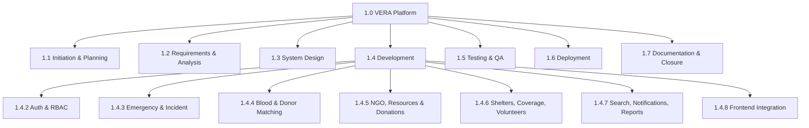
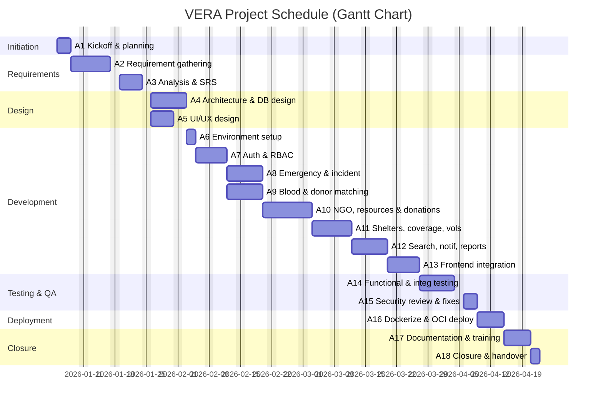
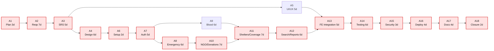

# B — Project Management

**VERA: Volunteer Emergency Response Alliance**

## Document Information

| Field | Detail |
|-------|--------|
| **Course** | CSE307 — System Analysis and Design |
| **Phase** | 5 — System Analysis and Development Issues |
| **Section** | B — Project Management |
| **Currency** | BDT (৳) |
| **Schedule basis** | Working days |

---

## B1. Project Plan and Work Breakdown Structure (WBS)

### B1.1 Project Plan Summary

| Attribute | Value |
|-----------|-------|
| **Project** | VERA — Volunteer Emergency Response Alliance |
| **Approach** | Agile Scrum (see Section A), scheduled as an incremental plan |
| **Total duration** | 78 working days (~16 weeks) |
| **Team size** | 2 developers playing multiple roles |
| **WBS basis** | **Entire project**, decomposed to module-level work packages |

The WBS below is based on the **entire project** and then decomposed by **software module** inside the Development work package (WBS 4). This gives full coverage of initiation, analysis, design, module development, testing, deployment, and closure.

---

### B1.2 Work Breakdown Structure (Indented List)

```
1.0  VERA — Emergency Response Platform
├── 1.1  Project Initiation & Planning
│    ├── 1.1.1  Define scope, goals, objectives
│    ├── 1.1.2  Form team & assign roles
│    └── 1.1.3  Prepare project & sprint plan
├── 1.2  Requirements & Analysis
│    ├── 1.2.1  Requirement gathering (interviews, surveys, observation)
│    ├── 1.2.2  Requirement analysis & SRS
│    └── 1.2.3  Feasibility confirmation
├── 1.3  System Design
│    ├── 1.3.1  System architecture & ERD / database design
│    └── 1.3.2  UI/UX design (wireframes, screens)
├── 1.4  Development (by module)
│    ├── 1.4.1  Environment & project setup
│    ├── 1.4.2  Authentication & RBAC module
│    ├── 1.4.3  Emergency & incident module
│    ├── 1.4.4  Blood request & donor-matching module
│    ├── 1.4.5  NGO resources, coordination & donations module
│    ├── 1.4.6  Shelters, coverage, volunteers & certificates module
│    ├── 1.4.7  Search, notifications, dashboard & admin reports
│    └── 1.4.8  Frontend integration
├── 1.5  Testing & Quality Assurance
│    ├── 1.5.1  Functional & integration testing
│    └── 1.5.2  Security review & fixes
├── 1.6  Deployment
│    └── 1.6.1  Dockerization & OCI cloud deployment
└── 1.7  Documentation & Closure
     ├── 1.7.1  Documentation & training material
     └── 1.7.2  Project closure & handover
```

### B1.3 WBS Diagram



---

## B2. Activity List — Duration, Dependencies, Resources & Costing

**Resource daily rates (BDT):**

| Resource | Rate/day (৳) |
|----------|-------------|
| Project Manager (PM) | 3,000 |
| Business Analyst (BA) | 2,500 |
| System Architect (SA) | 3,000 |
| UI/UX Designer (UX) | 2,200 |
| Backend Developer (BE) | 2,500 |
| Frontend Developer (FE) | 2,500 |
| Full-stack Developer (FS) | 2,800 |
| QA Engineer (QA) | 2,000 |
| DevOps Engineer (DO) | 2,800 |
| Technical Writer (TW) | 1,800 |

**Responsible parties (single accountable owner per task):**

| Code | Team member | Primary roles played |
|------|-------------|----------------------|
| **MH** | Md. Mahmudul Hasan (2311960) | PM, System Architect, Backend, DevOps |
| **RHK** | Ridwan Hasan Khandakar (2310604) | Business Analyst, UI/UX, Full-stack, Frontend |

Following the WBS guideline that **each task has a single responsible person**, every activity below has exactly one accountable owner (the *Responsible Party*), even where a role/resource type is shared.

**Activity table:**

| ID | Activity | Duration (days) | Predecessor(s) | Resource | Responsible Party | Cost (৳) |
|----|----------|-----------------|----------------|----------|-------------------|----------|
| A1 | Project kickoff & planning | 3 | — | PM | MH | 9,000 |
| A2 | Requirement gathering | 7 | A1 | BA | RHK | 17,500 |
| A3 | Requirement analysis & SRS | 5 | A2 | BA | RHK | 12,500 |
| A4 | System architecture & database design | 6 | A3 | SA | MH | 18,000 |
| A5 | UI/UX design | 5 | A3 | UX | RHK | 11,000 |
| A6 | Environment & project setup | 2 | A4 | BE | MH | 5,000 |
| A7 | Auth & RBAC module | 5 | A6 | BE | MH | 12,500 |
| A8 | Emergency & incident module | 6 | A7 | FS | RHK | 16,800 |
| A9 | Blood request & donor-matching module | 6 | A7 | BE | MH | 15,000 |
| A10 | NGO resources, coordination & donations | 7 | A8 | FS | RHK | 19,600 |
| A11 | Shelters, coverage, volunteers & certificates | 7 | A9, A10 | FS | MH | 19,600 |
| A12 | Search, notifications, dashboard & admin reports | 6 | A11 | FS | RHK | 16,800 |
| A13 | Frontend integration | 5 | A5, A12 | FE | RHK | 12,500 |
| A14 | Functional & integration testing | 6 | A13 | QA | MH | 12,000 |
| A15 | Security review & fixes | 3 | A14 | BE | MH | 7,500 |
| A16 | Dockerization & OCI deployment | 4 | A15 | DO | MH | 11,200 |
| A17 | Documentation & training | 4 | A16 | TW | RHK | 7,200 |
| A18 | Project closure & handover | 2 | A17 | PM | MH | 6,000 |
| | **Total** | **78 (critical path)** | | | | **229,700** |

> **Total labour cost = ৳ 229,700.** Non-labour costs (infrastructure, tools, contingency) are added in the Feasibility Analysis (Section C).

---

## B3. Gantt Chart

The Gantt chart below is generated from the activity list (durations and dependencies). Dates assume a project start of **05 Jan 2026** on a working-day calendar.



---

## B4. Network Diagram (Activity-on-Node) & Critical Path

The network diagram shows precedence relationships between activities. The **critical path** (longest path, zero slack) is highlighted in red.



### B4.1 Critical Path

```
A1 → A2 → A3 → A4 → A6 → A7 → A8 → A10 → A11 → A12 → A13 → A14 → A15 → A16 → A17 → A18
```

| Metric | Value |
|--------|-------|
| **Critical path length** | 3+7+5+6+2+5+6+7+7+6+5+6+3+4+4+2 = **78 days** |
| **Project duration** | 78 working days |
| **Non-critical activities (with slack)** | A5 (UI/UX), A9 (Blood module) |

### B4.2 Forward-Pass Schedule (Earliest Start / Finish)

| Activity | Duration | Earliest Start | Earliest Finish |
|----------|----------|----------------|-----------------|
| A1 | 3 | 0 | 3 |
| A2 | 7 | 3 | 10 |
| A3 | 5 | 10 | 15 |
| A4 | 6 | 15 | 21 |
| A5 | 5 | 15 | 20 |
| A6 | 2 | 21 | 23 |
| A7 | 5 | 23 | 28 |
| A8 | 6 | 28 | 34 |
| A9 | 6 | 28 | 34 |
| A10 | 7 | 34 | 41 |
| A11 | 7 | 41 | 48 |
| A12 | 6 | 48 | 54 |
| A13 | 5 | 54 | 59 |
| A14 | 6 | 59 | 65 |
| A15 | 3 | 65 | 68 |
| A16 | 4 | 68 | 72 |
| A17 | 4 | 72 | 76 |
| A18 | 2 | 76 | 78 |

**Slack examples:** A5 finishes at day 20 but A13 cannot start until day 54 → slack = 34 days. A9 finishes at day 34 but A11 starts at day 41 → slack = 7 days. All red-highlighted activities have **zero slack**.

---

## Phase Navigation

| | Document |
|---|----------|
| **Previous** | [A — Software Development Methodology](./A-development-methodology.md) |
| **Current** | B — Project Management |
| **Next** | [C — Feasibility Analysis](./C-feasibility-analysis.md) |

---

*Phase 5 — System Analysis and Development Issues | VERA*
