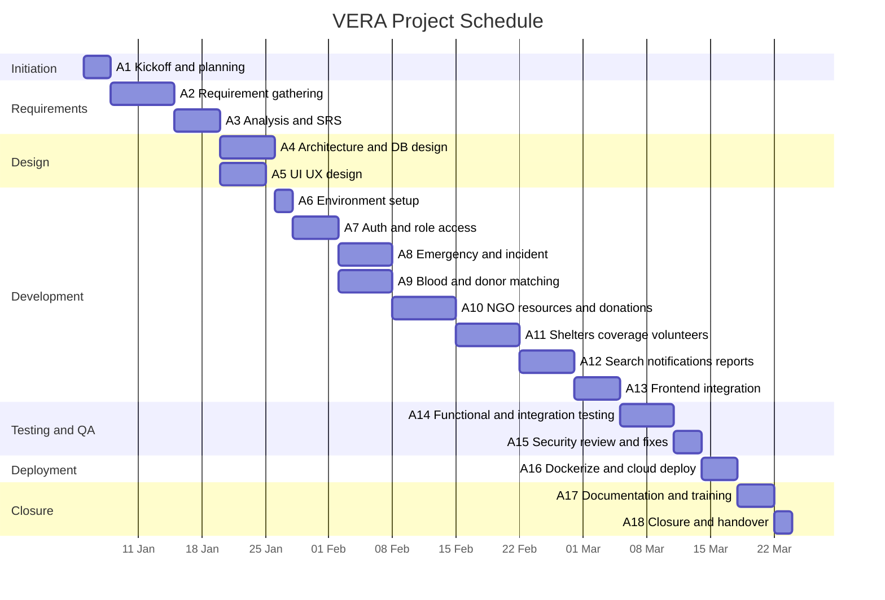
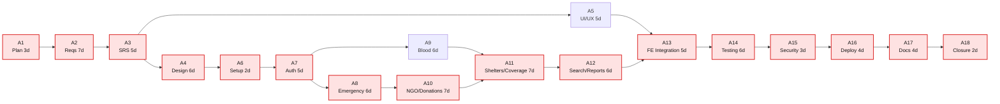

# B — Project Management

**Title:** Volunteer Emergency Response Alliance (VERA)

## Group Members

| ID | Name | Contribution |
|----|------|--------------|
| 2311960 | Md. Mahmudul Hasan | 100% |
| 2310604 | Ridwan Hasan Khandakar | 100% |
| 2022752 | Kazi Fatema Tuj Johra | 100% |
| 2312226 | Fouzia Abida | 100% |
| 2310690 | Syed Mehedi Hussain | 100% |
| 2210892 | Sowhardra Paul | 100% |

**Course:** CSE307 — System Analysis and Design · **Task 5(B):** Project Management · **Currency:** BDT (৳)

---

## B1. Project Plan and Work Breakdown Structure (WBS)

### B1.1 What Is a WBS?

As we learned in Lecture 3, a big project is hard to manage as one large job. So we break it down into smaller tasks or activities. Together these tasks form a **Work Breakdown Structure (WBS)**.

Lecture 3 also gives three **WBS properties**, which we followed:
1. Each task gives **one deliverable** (one clear result).
2. Each task can be given to a **single person or group**.
3. Each task has **one responsible person** who monitors it.

### B1.2 Basis of Our WBS

The task says the WBS can be based on the **software modules** or the **entire project**. We based ours on the **entire project**. This means all seven phases of the project (planning, requirements, design, development, testing, deployment, and documentation) are broken down. Inside the **Development** phase, we also break the work down by **software module**, so both ideas are covered.

### B1.3 WBS — Indented List

```
1.0  VERA — Emergency Response Platform
├── 1.1  Project Initiation & Planning
│    ├── 1.1.1  Define scope, goals, objectives
│    ├── 1.1.2  Form team & assign roles
│    └── 1.1.3  Prepare project & sprint plan
├── 1.2  Requirements & Analysis
│    ├── 1.2.1  Requirement gathering (interviews, surveys, observation)
│    ├── 1.2.2  Requirement analysis & SRS
│    └── 1.2.3  Feasibility confirmation
├── 1.3  System Design
│    ├── 1.3.1  System architecture & database design
│    └── 1.3.2  UI/UX design (screens, wireframes)
├── 1.4  Development (by module)
│    ├── 1.4.1  Environment & project setup
│    ├── 1.4.2  Authentication & role access module
│    ├── 1.4.3  Emergency & incident module
│    ├── 1.4.4  Blood request & donor-matching module
│    ├── 1.4.5  NGO resources, coordination & donations module
│    ├── 1.4.6  Shelters, coverage, volunteers & certificates module
│    ├── 1.4.7  Search, notifications, dashboard & admin reports
│    └── 1.4.8  Frontend integration
├── 1.5  Testing & Quality Assurance
│    ├── 1.5.1  Functional & integration testing
│    └── 1.5.2  Security review & fixes
├── 1.6  Deployment
│    └── 1.6.1  Dockerization & cloud deployment
└── 1.7  Documentation & Closure
     ├── 1.7.1  Documentation & training material
     └── 1.7.2  Project closure & handover
```

### B1.4 WBS — Diagram

All seven phases are broken down to the third level. The Development phase is broken down by software module.

```mermaid
graph TD
    P[1.0 VERA Platform]

    P --> W1[1.1 Initiation & Planning]
    W1 --> W1a[1.1.1 Scope & objectives]
    W1 --> W1b[1.1.2 Team & roles]
    W1 --> W1c[1.1.3 Project & sprint plan]

    P --> W2[1.2 Requirements & Analysis]
    W2 --> W2a[1.2.1 Requirement gathering]
    W2 --> W2b[1.2.2 Analysis & SRS]
    W2 --> W2c[1.2.3 Feasibility confirmation]

    P --> W3[1.3 System Design]
    W3 --> W3a[1.3.1 Architecture & DB design]
    W3 --> W3b[1.3.2 UI/UX design]

    P --> W4[1.4 Development - by module]
    W4 --> M0[1.4.1 Environment setup]
    W4 --> M1[1.4.2 Auth & role access]
    W4 --> M2[1.4.3 Emergency & Incident]
    W4 --> M3[1.4.4 Blood & Donor Matching]
    W4 --> M4[1.4.5 NGO, Resources & Donations]
    W4 --> M5[1.4.6 Shelters, Coverage, Volunteers]
    W4 --> M6[1.4.7 Search, Notifications, Reports]
    W4 --> M7[1.4.8 Frontend Integration]

    P --> W5[1.5 Testing & QA]
    W5 --> W5a[1.5.1 Functional & integration testing]
    W5 --> W5b[1.5.2 Security review & fixes]

    P --> W6[1.6 Deployment]
    W6 --> W6a[1.6.1 Dockerize & cloud deploy]

    P --> W7[1.7 Documentation & Closure]
    W7 --> W7a[1.7.1 Documentation & training]
    W7 --> W7b[1.7.2 Closure & handover]
```



---

## B2. Activity List (Duration, Dependencies, Resources, and Cost)

### B2.1 Team Codes (Responsible Person)

Following the WBS rule that **each task has one responsible person**, we gave every activity a single owner from our group.

| Code | Group member |
|------|--------------|
| MH | Md. Mahmudul Hasan |
| RHK | Ridwan Hasan Khandakar |
| KFJ | Kazi Fatema Tuj Johra |
| FA | Fouzia Abida |
| SMH | Syed Mehedi Hussain |
| SP | Sowhardra Paul |

### B2.2 Resource Rates

To estimate cost, we gave each role a daily rate (as Lecture 3 says: estimate the cost for each activity in the WBS).

| Role | Rate/day (৳) |
|------|-------------|
| Project Manager (PM) | 3,000 |
| Business Analyst (BA) | 2,500 |
| System Architect (SA) | 3,000 |
| UI/UX Designer (UX) | 2,200 |
| Backend Developer (BE) | 2,500 |
| Frontend Developer (FE) | 2,500 |
| Full-stack Developer (FS) | 2,800 |
| QA Engineer (QA) | 2,000 |
| DevOps Engineer (DO) | 2,800 |
| Technical Writer (TW) | 1,800 |

### B2.3 Activity List Table

Cost of each activity = duration × the role's daily rate.

| ID | Activity | Duration (days) | Depends on | Role | Responsible | Cost (৳) |
|----|----------|-----------------|------------|------|-------------|----------|
| A1 | Project kickoff & planning | 3 | — | PM | MH | 9,000 |
| A2 | Requirement gathering | 7 | A1 | BA | KFJ | 17,500 |
| A3 | Requirement analysis & SRS | 5 | A2 | BA | KFJ | 12,500 |
| A4 | System architecture & database design | 6 | A3 | SA | MH | 18,000 |
| A5 | UI/UX design | 5 | A3 | UX | FA | 11,000 |
| A6 | Environment & project setup | 2 | A4 | BE | RHK | 5,000 |
| A7 | Authentication & role access module | 5 | A6 | BE | MH | 12,500 |
| A8 | Emergency & incident module | 6 | A7 | FS | RHK | 16,800 |
| A9 | Blood request & donor-matching module | 6 | A7 | BE | SMH | 15,000 |
| A10 | NGO resources, coordination & donations | 7 | A8 | FS | SP | 19,600 |
| A11 | Shelters, coverage, volunteers & certificates | 7 | A9, A10 | FS | FA | 19,600 |
| A12 | Search, notifications, dashboard & admin reports | 6 | A11 | FS | SMH | 16,800 |
| A13 | Frontend integration | 5 | A5, A12 | FE | RHK | 12,500 |
| A14 | Functional & integration testing | 6 | A13 | QA | KFJ | 12,000 |
| A15 | Security review & fixes | 3 | A14 | BE | MH | 7,500 |
| A16 | Dockerization & cloud deployment | 4 | A15 | DO | SP | 11,200 |
| A17 | Documentation & training | 4 | A16 | TW | FA | 7,200 |
| A18 | Project closure & handover | 2 | A17 | PM | MH | 6,000 |
| | **Total** | | | | | **229,700** |

**Total labour cost = ৳ 229,700.** (Other costs like servers and tools are added in Section C.)

---

## B3. Gantt Chart

Lecture 3 says a **Gantt chart** is a simple, easy-to-read chart drawn to scale that shows the schedule to users. Our schedule runs over about **12 weeks** (78 working days). In the chart below, a filled block (█) means the activity is being worked on during that week. Some activities overlap because they run in parallel (for example A4 and A5, or A8 and A9).

### Gantt Chart (Week View)

| Activity | W1 | W2 | W3 | W4 | W5 | W6 | W7 | W8 | W9 | W10 | W11 | W12 |
|----------|----|----|----|----|----|----|----|----|----|-----|-----|-----|
| A1 Kickoff & planning | █ | | | | | | | | | | | |
| A2 Requirement gathering | █ | █ | | | | | | | | | | |
| A3 Analysis & SRS | | █ | █ | | | | | | | | | |
| A4 Architecture & DB design | | | █ | █ | | | | | | | | |
| A5 UI/UX design | | | █ | | | | | | | | | |
| A6 Environment setup | | | | █ | | | | | | | | |
| A7 Auth & role access | | | | █ | █ | | | | | | | |
| A8 Emergency & incident | | | | | █ | | | | | | | |
| A9 Blood & donor matching | | | | | █ | | | | | | | |
| A10 NGO, resources & donations | | | | | █ | █ | | | | | | |
| A11 Shelters, coverage, volunteers | | | | | | █ | █ | | | | | |
| A12 Search, notifications, reports | | | | | | | █ | █ | | | | |
| A13 Frontend integration | | | | | | | | █ | █ | | | |
| A14 Functional & integration testing | | | | | | | | | █ | █ | | |
| A15 Security review & fixes | | | | | | | | | | █ | | |
| A16 Dockerize & cloud deploy | | | | | | | | | | █ | █ | |
| A17 Documentation & training | | | | | | | | | | | █ | |
| A18 Closure & handover | | | | | | | | | | | █ | █ |

*(This table renders in every viewer. Below is the same chart as a Mermaid diagram, which renders where Mermaid gantt is supported — e.g. GitHub.)*

### Same Chart (Mermaid — optional)



---

## B4. Network Diagram (PERT) and Critical Path

Lecture 3 says a **PERT / network diagram** is useful when some activities can be done in parallel, and it helps us find the **critical path** and the **slack time**. The diagram below shows each activity as a box (Activity-on-Node). The **critical path** is shown in red.



### B4.1 Critical Path

The **critical path** is the longest chain of activities. If any activity on it is late, the whole project is late.

```
A1 → A2 → A3 → A4 → A6 → A7 → A8 → A10 → A11 → A12 → A13 → A14 → A15 → A16 → A17 → A18
```

| Item | Value |
|------|-------|
| Critical path length | 3+7+5+6+2+5+6+7+7+6+5+6+3+4+4+2 = **78 days** |
| Total project time | **78 working days** |
| Activities with slack (not critical) | A5 (UI/UX) and A9 (Blood module) |

### B4.2 Forward Pass (Earliest Start and Finish)

This table shows when each activity can start and finish at the earliest.

| Activity | Duration | Earliest Start | Earliest Finish |
|----------|----------|----------------|-----------------|
| A1 | 3 | 0 | 3 |
| A2 | 7 | 3 | 10 |
| A3 | 5 | 10 | 15 |
| A4 | 6 | 15 | 21 |
| A5 | 5 | 15 | 20 |
| A6 | 2 | 21 | 23 |
| A7 | 5 | 23 | 28 |
| A8 | 6 | 28 | 34 |
| A9 | 6 | 28 | 34 |
| A10 | 7 | 34 | 41 |
| A11 | 7 | 41 | 48 |
| A12 | 6 | 48 | 54 |
| A13 | 5 | 54 | 59 |
| A14 | 6 | 59 | 65 |
| A15 | 3 | 65 | 68 |
| A16 | 4 | 68 | 72 |
| A17 | 4 | 72 | 76 |
| A18 | 2 | 76 | 78 |

**Slack (free time) example:** A5 finishes at day 20, but A13 does not start until day 54, so A5 has a lot of slack (it is not on the critical path). A9 finishes at day 34, but A11 starts at day 41, so A9 has 7 days of slack. The red activities have **no slack** — they must be done on time.

---

## Short Answer (Summary)

We broke VERA into a **WBS** covering the whole project (7 phases), with the Development phase split by module. We made an **activity list** of 18 activities with their duration, what they depend on, the role needed, the responsible group member, and the cost (total **৳ 229,700**). We drew a **Gantt chart** for the schedule and a **PERT/network diagram** to find the **critical path (78 days)** and the slack time of the non-critical activities (A5 and A9).

---

*CSE307 — System Analysis and Design | Task 5(B) | VERA*
