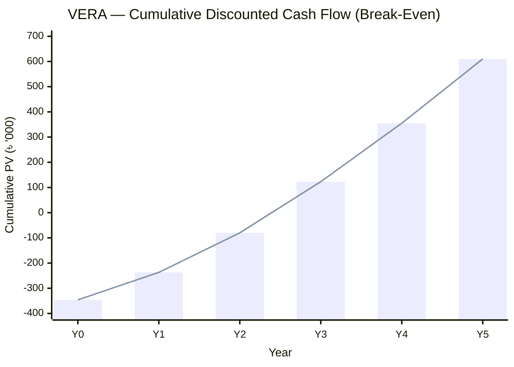

# C — Feasibility Analysis

**VERA: Volunteer Emergency Response Alliance**

## Document Information

| Field | Detail |
|-------|--------|
| **Course** | CSE307 — System Analysis and Design |
| **Phase** | 5 — System Analysis and Development Issues |
| **Section** | C — Feasibility Analysis |
| **Currency** | BDT (৳) |
| **Analysis horizon** | 5 years |
| **Discount rate** | 10% |

---

## C1. Expense Heads (Cost of Implementing the Project)

Costs are split into a **one-time initial investment (Year 0)** and **recurring annual operating costs (Years 1–5)**.

### C1.1 One-Time Implementation Costs (Year 0)

| # | Expense Head | Description | Cost (৳) |
|---|--------------|-------------|----------|
| 1 | Development labour | All activities A1–A18 (from Section B) | 229,700 |
| 2 | Hardware | Developer machines / test devices allocation | 40,000 |
| 3 | Cloud infrastructure setup | Initial OCI VM, storage, network configuration | 15,000 |
| 4 | Software tools & licences | Design tools, IDE, testing tools | 12,000 |
| 5 | Testing devices | Cross-device / browser testing | 8,000 |
| 6 | Training material development | User guides, onboarding content | 7,000 |
| 7 | Domain + SSL (first year) | Domain registration and certificate | 3,000 |
| | **Subtotal** | | **314,700** |
| 8 | Contingency (10%) | Risk buffer | 31,470 |
| | **Total Initial Investment (Year 0)** | | **346,170** |

### C1.2 Recurring Annual Operating Costs (Years 1–5)

| # | Expense Head | Cost/year (৳) |
|---|--------------|---------------|
| 1 | Cloud hosting (OCI production tier) | 36,000 |
| 2 | Maintenance & support (part-time developer) | 60,000 |
| 3 | SMS / email notification gateway | 12,000 |
| 4 | Marketing & community outreach | 20,000 |
| 5 | Domain + SSL renewal | 3,000 |
| | **Total Annual Operating Cost** | **131,000 ≈ 130,000** |

> Annual operating cost is taken as **৳ 130,000/year** in the cash-flow model.

---

## C2. Possible Benefits from the Project

Benefits combine **tangible (monetised)** and **intangible (social)** value. For the financial model, tangible benefits are estimated per year and grow as adoption increases.

### C2.1 Tangible (Monetised) Benefits

| # | Benefit | Basis of value |
|---|---------|----------------|
| 1 | NGO coordination cost savings | Fewer phone chains, less duplicated field effort |
| 2 | Reduced duplicated relief spending | Coverage monitoring prevents overlap |
| 3 | Increased & transparent donations | Higher donor trust → more contributions channelled |
| 4 | Volunteer time efficiency | Faster matching of volunteers to needs |
| 5 | Sponsorship / grants / partnerships | Platform attracts CSR and grant funding |

**Estimated annual tangible benefit (growing with adoption):**

| Year | Estimated Benefit (৳) |
|------|-----------------------|
| Year 1 | 250,000 |
| Year 2 | 320,000 |
| Year 3 | 400,000 |
| Year 4 | 470,000 |
| Year 5 | 540,000 |

### C2.2 Intangible (Social) Benefits

- **Lives saved / faster emergency response** — the highest-value outcome, hard to price.
- Increased **public trust** and transparency in disaster relief.
- Stronger, **verified volunteer network** that stays active between disasters.
- Better **data for authorities** on underserved areas.
- Improved **student engagement** through certificate programs.

---

## C3. Net Present Value (NPV) Table

### C3.0 Discount Rate Justification

Course examples typically use a **12%** discount rate as a generic default. VERA uses **10%**, justified by its specific context:

| Factor | Effect on rate |
|--------|----------------|
| **Non-profit / social platform** | A humanitarian project carries a lower required rate of return than a commercial venture; social benefit partly substitutes for financial return. |
| **Grant & CSR funding** | Part of the capital comes from grants/sponsorships (lower cost of capital than commercial loans), pulling the effective rate down. |
| **Low-cost cloud infrastructure** | OCI free/low-cost tier reduces capital risk, supporting a slightly lower discount rate. |

A **sensitivity check** confirms the decision is robust: even at the course-standard **12%**, NPV = **৳ 553,336** (PV of inflows ৳ 899,506 − investment ৳ 346,170), still clearly positive. The feasibility verdict therefore does not depend on the choice of 10% vs 12%.

**Inputs:** Initial investment = ৳ 346,170 · Operating cost = ৳ 130,000/year · Discount rate = 10% (12% used for sensitivity check).

**Discount factor formula:** $DF_n = \dfrac{1}{(1+i)^n}$ where *i* = discount rate and *n* = year.

**Net cash flow = Annual benefit − Annual operating cost.**

| Year | Benefit (৳) | Operating Cost (৳) | Net Cash Flow (৳) | Discount Factor @10% | Present Value (৳) | Cumulative PV (৳) |
|------|-------------|--------------------|--------------------|-----------------------|-------------------|-------------------|
| 0 | — | — | **−346,170** | 1.0000 | **−346,170** | −346,170 |
| 1 | 250,000 | 130,000 | 120,000 | 0.9091 | 109,091 | −237,079 |
| 2 | 320,000 | 130,000 | 190,000 | 0.8264 | 157,026 | −80,053 |
| 3 | 400,000 | 130,000 | 270,000 | 0.7513 | 202,854 | 122,801 |
| 4 | 470,000 | 130,000 | 340,000 | 0.6830 | 232,223 | 355,024 |
| 5 | 540,000 | 130,000 | 410,000 | 0.6209 | 254,577 | 609,601 |
| | | | | **PV of inflows** | **955,771** | |

### C3.1 Results

| Metric | Value | Interpretation |
|--------|-------|----------------|
| **NPV** | ৳ 955,771 − ৳ 346,170 = **৳ 609,601** | Positive → project is financially **feasible** |
| **Profitability Index (PI)** | 955,771 / 346,170 = **2.76** | > 1 → creates value |
| **Discounted Payback Period** | ≈ **2.4 years** (during Year 3) | Investment recovered mid Year 3 |

Because **NPV > 0** and **PI > 1**, the project is economically justified.

---

## C4. Return on Investment (ROI)

### C4.1 ROI Calculation

| Item | Value (৳) |
|------|-----------|
| Total net cash inflow (Years 1–5, undiscounted) | 120,000 + 190,000 + 270,000 + 340,000 + 410,000 = **1,330,000** |
| Total initial investment | 346,170 |
| **Net profit** (inflow − investment) | 1,330,000 − 346,170 = **983,830** |

$$
\text{ROI} = \frac{\text{Net Profit}}{\text{Total Investment}} = \frac{983{,}830}{346{,}170} \approx 2.84 = \mathbf{284\%}
$$

| ROI metric | Value |
|------------|-------|
| Simple ROI (5-year, undiscounted) | **284%** |
| Discounted ROI (NPV / Investment) | 609,601 / 346,170 ≈ **176%** |

### C4.2 ROI / Break-Even Chart (Cumulative Discounted Cash Flow)

The project **breaks even during Year 3**, where cumulative present value crosses zero.

### C4.3 ROI Interpretation Table

| Year | Cumulative Discounted Cash Flow (৳) | Status |
|------|-------------------------------------|--------|
| Year 0 | −346,170 | Investment outflow |
| Year 1 | −237,079 | Recovering |
| Year 2 | −80,053 | Recovering |
| Year 3 | +122,801 | **Break-even reached** |
| Year 4 | +355,024 | Profit |
| Year 5 | +609,601 | Profit (= NPV) |

---

## C5. Feasibility Summary

| Feasibility Type | Assessment | Verdict |
|------------------|------------|---------|
| **Economic** | NPV ৳ 609,601 (+), ROI 284%, payback ~2.4 yrs | ✅ Feasible |
| **Technical** | Proven stack (Next.js, FastAPI, PostgreSQL), team has skills, deployable on OCI free/low-cost tier | ✅ Feasible |
| **Operational** | Solves real coordination gaps; stakeholders willing to adopt | ✅ Feasible |
| **Schedule** | 78-day critical path fits the academic timeline (Section B) | ✅ Feasible |
| **Legal/Social** | Handles personal data → requires privacy controls (already in NFRs) | ✅ Feasible with safeguards |

**Conclusion:** VERA is **feasible on all dimensions**. The positive NPV, high ROI, and short payback period, combined with significant intangible social benefits (faster emergency response), strongly justify implementation.

---

## Phase Navigation

| | Document |
|---|----------|
| **Previous** | [B — Project Management](./B-project-management.md) |
| **Current** | C — Feasibility Analysis |
| **Next** | [D — Requirement Discovery](./D-requirement-discovery.md) |

---

*Phase 5 — System Analysis and Development Issues | VERA*
