# 18 — Entity Relationship Diagram (ERD)

**VERA: Volunteer Emergency Response Alliance**

## Document Information

| Field | Detail |
|-------|--------|
| **Phase** | 4 — Technical Design Document (TDD) |
| **Database** | SQLite (dev) / PostgreSQL (production) |
| **ORM** | SQLAlchemy 2.0 |

---

## ERD Diagram

```mermaid
erDiagram
    USERS ||--o{ EMERGENCY_REQUESTS : "requests (requester)"
    USERS ||--o{ EMERGENCY_REQUESTS : "assigned (volunteer)"
    USERS ||--o{ BLOOD_REQUESTS : "requests"
    USERS ||--o{ RESOURCES : "manages"
    USERS ||--o{ NGO_COORDINATIONS : "creates"
    USERS ||--o{ DONATIONS : "donates"
    USERS ||--o{ FUNDRAISING_CAMPAIGNS : "creates"
    USERS ||--o{ NOTIFICATIONS : "receives"
    USERS ||--o{ SHELTERS : "manages"
    USERS ||--o{ INCIDENT_REPORTS : "reports"
    USERS ||--o{ VOLUNTEER_OPPORTUNITIES : "publishes"
    USERS ||--o{ VOLUNTEER_APPLICATIONS : "applies"
    USERS ||--o{ CERTIFICATES : "volunteer"
    USERS ||--o{ CERTIFICATES : "issues"
    USERS ||--o{ DISASTER_COVERAGE : "reports"

    FUNDRAISING_CAMPAIGNS ||--o{ DONATIONS : "receives"
    VOLUNTEER_OPPORTUNITIES ||--o{ VOLUNTEER_APPLICATIONS : "has"

    USERS {
        int id PK
        string email UK
        string full_name
        string phone
        string hashed_password
        enum role
        string organization_name
        string address
        float latitude
        float longitude
        enum blood_group
        bool available_for_donation
        enum id_document_type
        string id_document_number
        bool is_active
        bool is_verified
        enum verification_status
        datetime created_at
    }

    EMERGENCY_REQUESTS {
        int id PK
        int requester_id FK
        string title
        text description
        enum emergency_type
        enum status
        string location
        float latitude
        float longitude
        string contact_phone
        int assigned_volunteer_id FK
        bool is_verified
        datetime created_at
        datetime updated_at
    }

    BLOOD_REQUESTS {
        int id PK
        int requester_id FK
        string patient_name
        enum blood_group
        int units_needed
        string hospital_name
        string location
        string contact_phone
        text notes
        enum status
        bool is_urgent
        datetime created_at
    }

    RESOURCES {
        int id PK
        int organization_id FK
        string name
        enum resource_type
        int quantity
        string unit
        string location
        float latitude
        float longitude
        text notes
        datetime created_at
    }

    NGO_COORDINATIONS {
        int id PK
        int requester_id FK
        string title
        text message
        int volunteers_needed
        string location
        enum status
        datetime created_at
    }

    DONATIONS {
        int id PK
        int donor_id FK
        int campaign_id FK
        enum donation_type
        float amount
        text item_description
        string allocated_to
        datetime created_at
    }

    FUNDRAISING_CAMPAIGNS {
        int id PK
        int creator_id FK
        string title
        text description
        string cause
        float goal_amount
        float raised_amount
        enum status
        datetime created_at
    }

    NOTIFICATIONS {
        int id PK
        int user_id FK
        string title
        text message
        string link
        bool is_read
        datetime created_at
    }

    SHELTERS {
        int id PK
        string name
        string address
        int capacity
        int available_beds
        string contact_phone
        float latitude
        float longitude
        int managed_by FK
        bool is_active
        datetime created_at
    }

    INCIDENT_REPORTS {
        int id PK
        int reporter_id FK
        string title
        text description
        string disaster_type
        string severity
        string location
        float latitude
        float longitude
        enum status
        datetime created_at
    }

    VOLUNTEER_OPPORTUNITIES {
        int id PK
        int organization_id FK
        string title
        text description
        string location
        int slots
        int filled_slots
        string start_date
        string end_date
        enum status
        datetime created_at
    }

    VOLUNTEER_APPLICATIONS {
        int id PK
        int opportunity_id FK
        int volunteer_id FK
        enum status
        datetime created_at
    }

    CERTIFICATES {
        int id PK
        int volunteer_id FK
        int organization_id FK
        string program_name
        string certificate_code UK
        datetime issue_date
        bool is_verified
    }

    DISASTER_COVERAGE {
        int id PK
        string area_name
        float latitude
        float longitude
        enum coverage_status
        text notes
        int reported_by FK
        datetime updated_at
    }
```

---

## Entity Summary

| # | Entity | Table | Records describe |
|---|--------|-------|------------------|
| 1 | User | users | Platform accounts |
| 2 | EmergencyRequest | emergency_requests | Emergency assistance tickets |
| 3 | BloodRequest | blood_requests | Urgent blood needs |
| 4 | Resource | resources | NGO relief inventory |
| 5 | NGOCoordination | ngo_coordinations | Inter-org support requests |
| 6 | Donation | donations | Contributions |
| 7 | FundraisingCampaign | fundraising_campaigns | Fundraising drives |
| 8 | Notification | notifications | In-app alerts |
| 9 | Shelter | shelters | Emergency shelters |
| 10 | IncidentReport | incident_reports | Disaster incidents |
| 11 | VolunteerOpportunity | volunteer_opportunities | NGO volunteer programs |
| 12 | VolunteerApplication | volunteer_applications | Volunteer applications |
| 13 | Certificate | certificates | Participation certificates |
| 14 | DisasterCoverage | disaster_coverage | Area relief status |

---

## Relationship Cardinality

| Parent | Child | Relationship | FK |
|--------|-------|--------------|-----|
| User | EmergencyRequest | 1:N | requester_id |
| User | EmergencyRequest | 1:N | assigned_volunteer_id |
| User | BloodRequest | 1:N | requester_id |
| User | Resource | 1:N | organization_id |
| User | Donation | 1:N | donor_id |
| FundraisingCampaign | Donation | 1:N | campaign_id |
| User | FundraisingCampaign | 1:N | creator_id |
| VolunteerOpportunity | VolunteerApplication | 1:N | opportunity_id |
| User | VolunteerApplication | 1:N | volunteer_id |
| User | Certificate | 1:N | volunteer_id, organization_id |

---

## Enum Types

| Enum | Values |
|------|--------|
| UserRole | citizen, volunteer, donor, ngo, hospital, admin |
| VerificationStatus | pending, approved, rejected |
| EmergencyType | medical, blood, ambulance, food, shelter, rescue, transport, missing_person, other |
| EmergencyStatus | open, in_progress, verified, resolved, cancelled |
| BloodGroup | A+, A-, B+, B-, AB+, AB-, O+, O- |
| ResourceType | food, medicine, clothing, equipment, money, other |
| DonationType | money, food, medicine, clothing, equipment, other |
| CoverageStatus | served, partial, underserved, critical |
| CoordinationStatus | open, accepted, completed, cancelled |
| OpportunityStatus | open, closed, completed |
| ApplicationStatus | pending, approved, rejected |
| CampaignStatus | active, paused, completed |

---

## Design Notes

1. **Dual FK on emergency_requests:** `requester_id` and `assigned_volunteer_id` both reference `users`. SQLAlchemy relationship must specify `foreign_keys` on the User side.
2. **Certificate dual FK:** Both `volunteer_id` and `organization_id` reference `users` (different roles).
3. **Soft enums:** `incident_reports.disaster_type` and `severity` are strings for flexibility in MVP.

---

## Phase Navigation

| | Document |
|---|----------|
| **Previous** | [17 — SRS](../srs/17-srs.md) |
| **Current** | 18 — ERD |
| **Next** | [19 — System Design](./19-system-design.md) |

---

*Phase 4 — Technical Design Document | VERA*
