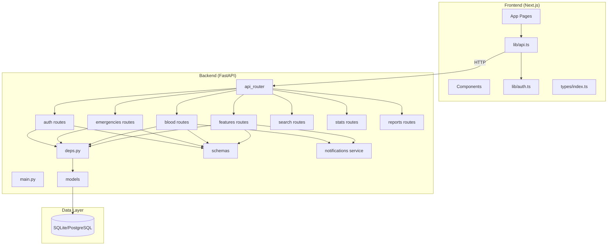
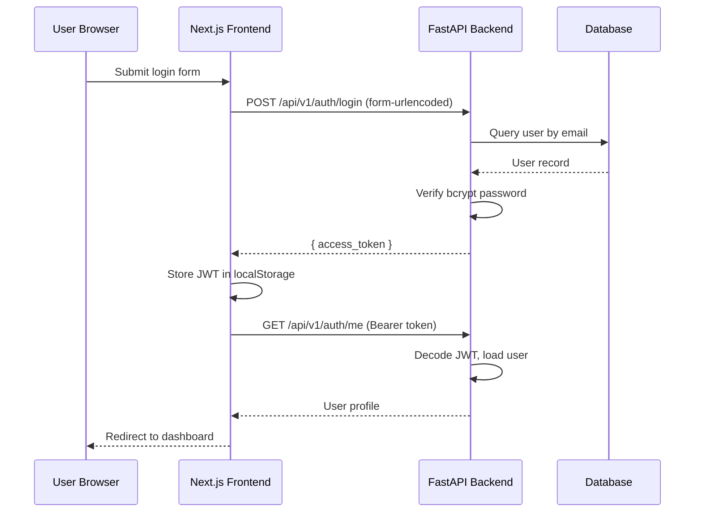
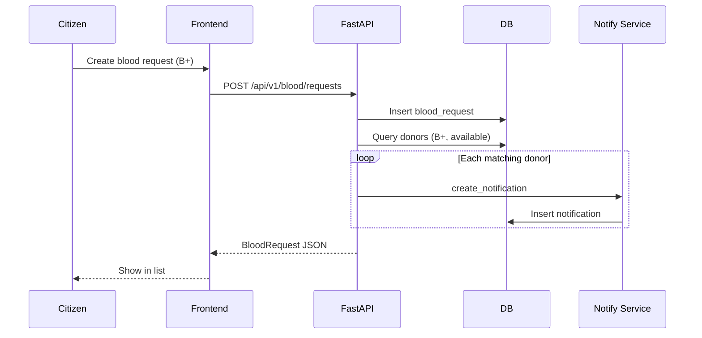

# 19 — System Design

**VERA: Volunteer Emergency Response Alliance**

## Document Information

| Field | Detail |
|-------|--------|
| **Phase** | 4 — Technical Design Document (TDD) |
| **Architecture** | Client-Server (3-tier) |

---

## 1. Architecture Overview

VERA follows a **three-tier architecture**:

```
┌─────────────────────────────────────────────────────────────┐
│                    PRESENTATION TIER                         │
│  Next.js 16 + React 19 + Tailwind CSS 4                     │
│  Pages: /dashboard, /emergencies, /blood, /donations, ...     │
│  Client state: localStorage (JWT), React hooks                │
└──────────────────────────┬──────────────────────────────────┘
                           │ HTTP/JSON (REST)
                           │ Authorization: Bearer JWT
┌──────────────────────────▼──────────────────────────────────┐
│                    APPLICATION TIER                          │
│  FastAPI + Uvicorn                                           │
│  ├── app/api/routes/     (HTTP handlers)                     │
│  ├── app/schemas/        (Pydantic validation)               │
│  ├── app/api/deps.py     (Auth dependencies)                 │
│  ├── app/services/       (Business logic)                    │
│  └── app/core/           (Config, DB, Security)              │
└──────────────────────────┬──────────────────────────────────┘
                           │ SQLAlchemy ORM
┌──────────────────────────▼──────────────────────────────────┐
│                      DATA TIER                               │
│  SQLite (development) / PostgreSQL (production)              │
│  14 tables — see ERD                                         │
└─────────────────────────────────────────────────────────────┘
```

---

## 2. Component Diagram



---

## 3. Backend Module Structure

```
backend/
├── app/
│   ├── main.py                 # FastAPI app, CORS, lifespan
│   ├── core/
│   │   ├── config.py           # Settings from .env
│   │   ├── database.py         # Engine, SessionLocal, Base
│   │   └── security.py         # bcrypt, JWT encode/decode
│   ├── models/
│   │   └── __init__.py         # SQLAlchemy models (14 entities)
│   ├── schemas/
│   │   └── __init__.py         # Pydantic request/response models
│   ├── api/
│   │   ├── deps.py             # get_current_user, require_roles
│   │   └── routes/
│   │       ├── auth.py
│   │       ├── emergencies.py
│   │       ├── blood.py
│   │       ├── features.py     # NGOs, donations, volunteers, etc.
│   │       ├── search.py
│   │       ├── stats.py
│   │       └── reports.py
│   └── services/
│       └── notifications.py    # create_notification helper
├── requirements.txt
└── .env
```

---

## 4. Frontend Module Structure

```
frontend/
├── src/
│   ├── app/                    # Next.js App Router pages
│   │   ├── page.tsx            # Landing
│   │   ├── login/
│   │   ├── register/
│   │   ├── dashboard/
│   │   ├── emergencies/
│   │   ├── blood/
│   │   ├── donations/
│   │   ├── resources/
│   │   ├── volunteers/
│   │   ├── shelters/
│   │   ├── incidents/
│   │   ├── coverage/
│   │   ├── search/
│   │   ├── notifications/
│   │   └── admin/
│   ├── components/
│   │   ├── Navbar.tsx
│   │   ├── AuthGuard.tsx
│   │   └── StatCard.tsx
│   ├── lib/
│   │   ├── api.ts              # API client
│   │   └── auth.ts             # Token management
│   └── types/
│       └── index.ts            # TypeScript interfaces
└── package.json
```

---

## 5. Authentication Flow



---

## 6. Blood Request Flow (with Notifications)



---

## 7. Deployment Architecture (Target)

```
                    ┌─────────────┐
                    │   Users     │
                    └──────┬──────┘
                           │ HTTPS
                    ┌──────▼──────┐
                    │   Nginx     │  Reverse proxy
                    └──────┬──────┘
              ┌────────────┼────────────┐
              │                         │
       ┌──────▼──────┐          ┌───────▼───────┐
       │  Next.js    │          │   FastAPI     │
       │  (SSR/SSG)  │          │   Uvicorn     │
       └─────────────┘          └───────┬───────┘
                                        │
                                 ┌──────▼──────┐
                                 │ PostgreSQL  │
                                 └─────────────┘
```

**Development:** `npm run dev` runs both via `concurrently`.

---

## 8. Security Design

| Layer | Mechanism |
|-------|-----------|
| Transport | HTTPS (production) |
| Authentication | JWT (HS256), 24h expiry |
| Password | bcrypt hashing |
| Authorization | `require_roles()` decorator per endpoint |
| Input | Pydantic schema validation |
| CORS | Whitelist origins via env |

---

## 9. Error Handling

| Layer | Strategy |
|-------|----------|
| Backend | FastAPI HTTPException with status codes (400, 401, 403, 404) |
| Frontend | `ApiError` class parses `detail` from JSON response |
| Validation | Pydantic 422 for invalid request bodies |

---

## 10. Technology Stack Summary

| Component | Technology | Version |
|-----------|------------|---------|
| Frontend framework | Next.js | 16 |
| UI library | React | 19 |
| Styling | Tailwind CSS | 4 |
| Backend framework | FastAPI | 0.115+ |
| ORM | SQLAlchemy | 2.0 |
| Validation | Pydantic | 2.x |
| Auth | python-jose + passlib | — |
| Dev orchestration | concurrently | 9.x |

---

## Phase Navigation

| | Document |
|---|----------|
| **Previous** | [18 — ERD](./18-erd.md) |
| **Current** | 19 — System Design |
| **Next** | [20 — TDD](./20-tdd.md) |

---

*Phase 4 — Technical Design Document | VERA*
